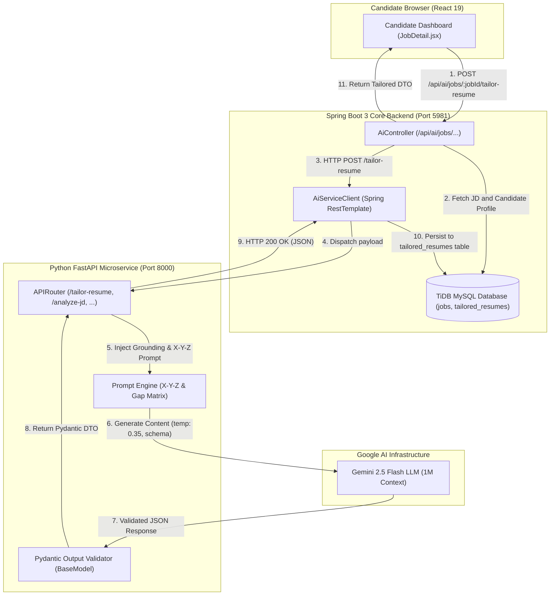
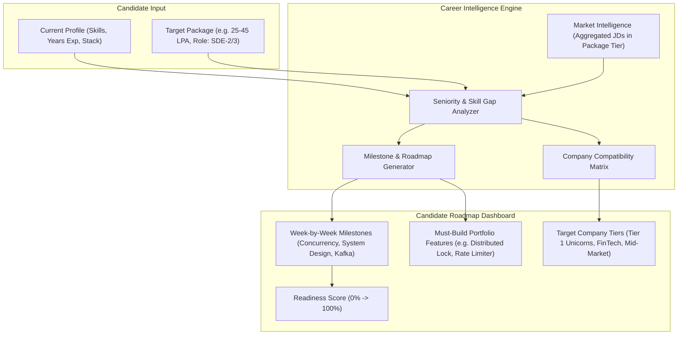

# AI Integration Architecture Guide: CrackIt

This guide documents the architecture, prompt engineering systems, schema enforcement, latency optimizations, and interview questions for the **AI Service & LLM Integration** in CrackIt.

---

## 1. Executive Summary

CrackIt decouples business and transaction logic from AI compute by maintaining an asynchronous **Polyglot Microservice Architecture**:
- **Spring Boot 3 (Java 17)**: Handles enterprise security, database persistence, caching, and payment state machines.
- **FastAPI (Python 3.10)**: Serves as the high-throughput AI gateway interfacing with **Google Gemini 2.5 Flash**.

Rather than relying on naive text generation, CrackIt implements a **Pydantic Schema-Enforced Pipeline** with **Few-Shot Grounding**, **Google's X-Y-Z Resume Metric Formula**, and **Calibrated Temperature Tuning**—operating entirely within Google's free-tier quota (1,500 free requests/day, 1M token context window).

---

## 2. End-to-End System Architecture Diagram



---

## 3. High-Signal Prompt Engineering Framework

### 3.1 The Google X-Y-Z Resume Tailoring Formula
Recruiters and hiring managers at Tier-1 tech firms reject generic bullet points (e.g., *"Built microservices with Spring Boot"*).
CrackIt enforces Google’s **X-Y-Z formula**:
$$\text{"Accomplished [X: Business Goal], as measured by [Y: Concrete Metric], by doing [Z: Tech Implementation]}"$$

```python
# From app/prompts/resume_tailoring_prompt.py
THE_GOOGLE_XYZ_RULE = """
Every bullet point under experience MUST strictly adhere to Google's standard:
"Accomplished [X], as measured by [Y], by doing [Z]."

Example:
"Architected distributed REST microservices using Spring Boot 3 and Redis Cache-Aside pattern, 
reducing p99 database read latency from 45ms to < 2ms and lowering DB connection pool load by 85%."
"""
```

### 3.2 Banned Phrases & Active Engineering Verbs
The prompt explicitly bans passive/junior phrases and enforces high-signal verbs:
- ❌ **Banned**: "Worked on", "Responsible for", "Helped with", "Assisted in", "Handled", "Good understanding of".
- ✅ **Required**: "Architected", "Engineered", "Decoupled", "Benchmarked", "Optimized", "Containerized", "Instrumented", "Refactored", "Hardened".

### 3.3 The 3-Tier Skill Gap Matrix (JD Analysis)
Instead of a simple flat percentage score, [`jd_analysis_prompt.py`](file:///home/stpl/Crackit/crackit-ai-service/app/prompts/jd_analysis_prompt.py) generates actionable career intelligence:
1. **Direct Matches**: Technologies the candidate has that match the JD.
2. **Transferable Skills**: Adjacent competencies (e.g. *RabbitMQ -> Kafka*, *PostgreSQL -> MySQL*).
3. **Critical Gaps (Dealbreakers)**: Missing core skills that will cause rejections in round 1.
4. **48-Hour Strategic Action Plan**: Immediate concepts or mini-projects to review before the interview.

---

## 4. Determinism & Schema Enforcement

### 4.1 Strict JSON Schema Guarantees (`response_schema`)
Unlike naive LLM wrappers that prompt *"Please return JSON"* and frequently fail with unparseable markdown, CrackIt uses the modern Google GenAI SDK's native schema enforcement:

```python
# In app/services/resume_tailoring_service.py
response = client.models.generate_content(
    model="gemini-2.5-flash",
    contents=prompt,
    config=types.GenerateContentConfig(
        response_mime_type="application/json",
        response_schema=ResumeTailoringResponse,
        temperature=0.35  # Low temperature for strict factual adherence
    )
)
```
- **Why it matters**: The model's token logits are constrained at generation time to only produce tokens that satisfy the Pydantic JSON Schema. Syntax errors and broken JSON are mathematically prevented.

### 4.2 Temperature Tuning Architecture
- **Resume Tailoring (`temperature=0.35`)**: Low temperature ensures strong adherence to the candidate's actual history (zero hallucination) while applying the X-Y-Z formula.
- **JD Analysis (`temperature=0.30`)**: Strict factual extraction of skills and seniority requirements.
- **Mock Interview Chat Coach (`temperature=0.70`)**: Slightly higher creativity for dynamic, human-like dialogue during live practice.

---

## 5. Blueprint: The Upcoming "Career Roadmap & Company Compatibility Engine"



### Roadmap Feature Architecture:
1. **Target Package Analysis**:
   - Analyzes the engineering bar required for the target CTC (e.g. ₹25L–₹40L+ demands multithreading, Kafka partition rebalancing, distributed locks, database indexing, and LLD/HLD).
2. **Week-by-Week Milestones**:
   - Breaks prep into weekly actionable deliverables (e.g., Week 1: Concurrency & Lock-Free data structures, Week 2: Redis Caching patterns, Week 3: Kafka event pipelines).
3. **Compatible Companies Categorization**:
   - Segments target companies by hiring bar and compensation tiers.

---

## 6. Top 10 Senior & Staff SWE Interview Questions & Answers

### Q1: Why separate the AI service into a Python FastAPI microservice instead of calling Gemini directly from Spring Boot?
> **Answer**: 
> 1. **Ecosystem & Libraries**: Python is the native lingua franca for AI/ML, offering superior support for PDF parsing (WeasyPrint, PyMuPDF) and early access to SDK features.
> 2. **Process Isolation**: Heavy PDF processing, text extraction, and token manipulation are CPU-bound. Isolating them prevents JVM garbage collection pauses or thread pool exhaustion on the main Spring Boot transactional backend.
> 3. **Independent Scaling**: The AI service can be scaled independently based on GPU/CPU requirements without scaling the relational database connection pool in Spring Boot.

---

### Q2: How do you prevent LLM hallucinations when tailoring resumes?
> **Answer**: 
> 1. **Few-Shot / Grounding Prompts**: The prompt strictly instructs the model to *only* reframe and elevate existing experiences, explicitly forbidding the invention of employers, degrees, or unmentioned projects.
> 2. **Low Temperature (`0.30 - 0.35`)**: Reduces randomness and forces the model to choose high-probability, factual tokens.
> 3. **Input Validation**: The backend injects the candidate's exact parsed resume sections. Any output company name or role not matching the input is rejected by validation logic.

---

### Q3: How do you ensure the LLM returns 100% valid JSON matching your database schema?
> **Answer**: We use **Constrained Decoding / Schema Enforcement** via `types.GenerateContentConfig(response_mime_type="application/json", response_schema=ModelClass)`. During generation, Gemini restricts the next-token sampling distribution to tokens that strictly adhere to the provided Pydantic JSON schema. If the model attempts to generate conversational markdown or invalid syntax, the token probability is zeroed out by the engine.

---

### Q4: How do you handle LLM latency (15–20s) so it doesn't freeze the Spring Boot backend?
> **Answer**: For synchronous endpoints (e.g., resume tailoring), we configure HTTP client read timeouts and display engaging animated overlays. For long-running operations like full interview prep curriculum generation, we use **Apache Kafka**: the frontend receives an immediate `202 Accepted`, while a background consumer invokes FastAPI and updates the database asynchronously.

---

### Q5: What is the difference between Prompt Engineering and Fine-Tuning? When would you fine-tune?
> **Answer**: 
> - **Prompt Engineering**: Steering an existing model through structured instructions, few-shot examples, and schema constraints. It costs zero training compute and adapts instantly.
> - **Fine-Tuning**: Modifying the model weights using a curated dataset of thousands of input-output pairs. 
> In CrackIt, prompt engineering with Gemini 2.5 Flash is vastly superior: modern LLMs already understand resume semantics and ATS scoring; fine-tuning would add unnecessary training costs and slow down feature iteration.

---

### Q6: How do you protect your AI endpoints from cost spikes and API abuse?
> **Answer**: 
> 1. **Tier Quota Enforcement**: In `SubscriptionService.java`, free users are hard-capped at 3 free generations. Pro subscribers have unlimited access.
> 2. **Redis In-Memory Caching**: If a candidate views the same JD or requests tailoring multiple times, results are cached in Redis (`@Cacheable`), eliminating repeated LLM API calls.
> 3. **Rate Limiting**: IP-based and user-based token bucket rate limiters prevent bot scraping.

---

### Q7: What is the "Google X-Y-Z formula", and why is it crucial for ATS and recruiter screening?
> **Answer**: The formula is: *"Accomplished [X], as measured by [Y], by doing [Z]"*. Recruiters review resumes in 6 seconds; they look for concrete engineering metrics (throughput, latency, percentage reduction) rather than vague responsibilities. Our tailoring engine transforms passive statements into quantified achievements.

---

### Q8: What happens if the Gemini API goes down or hits a rate limit (HTTP 429)?
> **Answer**:
> 1. **Exponential Backoff**: The SDK and client implement exponential backoff with jitter.
> 2. **Circuit Breaking**: If the AI service fails consistently, Spring Boot triggers a circuit breaker to fail fast and prevent thread starvation.
> 3. **Mock Mode Fallback**: During local development or severe outages, the system falls back to a deterministic mock generator, ensuring the user interface remains testable and responsive.

---

### Q9: How do you handle sensitive user data (PII) when sending resumes to third-party LLMs?
> **Answer**: 
> 1. In enterprise compliance, sensitive fields like phone numbers, physical addresses, and national IDs can be masked or scrubbed before sending prompts to the LLM.
> 2. We use enterprise API endpoints where data is not retained for model training per Google's data privacy commitments.

---

### Q10: How would you evaluate the quality of tailored resumes in production? (LLM Evaluation)
> **Answer**: 
> 1. **Automated LLM-as-a-Judge**: A separate evaluator prompt scores the tailored resume on: (a) X-Y-Z compliance (0-100), (b) ATS keyword recall (%), and (c) Factual grounding (detecting fabricated metrics).
> 2. **A/B Testing Conversion**: Tracking candidate interview callbacks: resumes tailored with the X-Y-Z engine vs untailored resumes.
