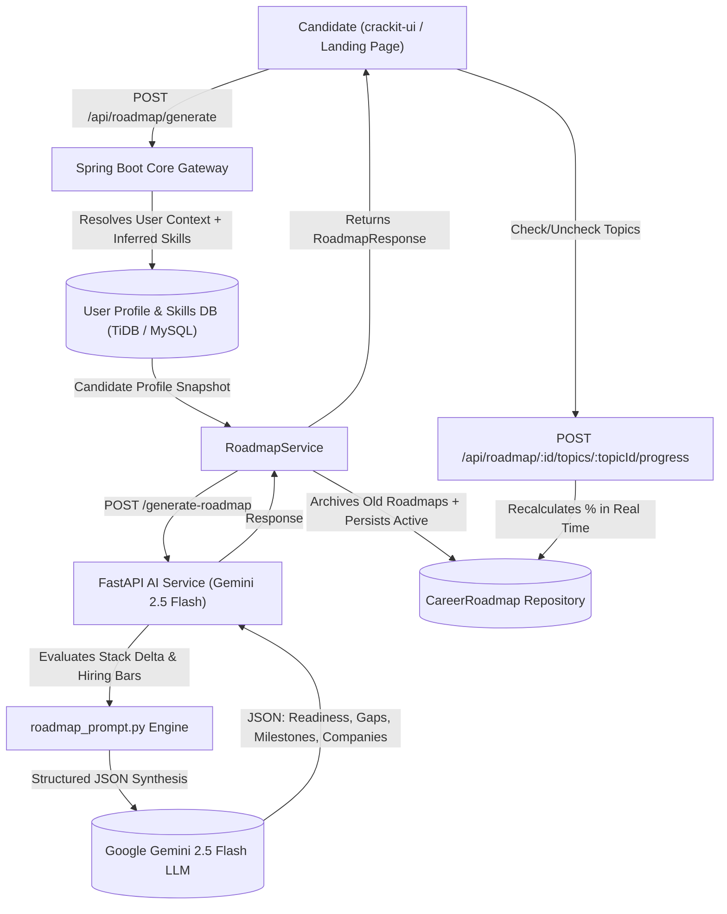

# Career Prep Roadmap & Target Company Compatibility Architecture Guide

This document details the architectural design, AI prompt engineering, database schema, and product design principles behind CrackIt's **Career Prep Roadmap and Target Company Compatibility Engine**.

---

## 1. Problem Statement: Why Most Career Roadmaps Fail

Standard online roadmaps (e.g. general tech roadmaps, generic YouTube playlists) fail ambitious engineers because they suffer from:
1. **Generic Fluff**: Advising experienced developers to "Learn Spring Boot basics" or "Read a System Design book" without analyzing their actual experience level.
2. **Disconnected from Compensation & Hiring Bars**: A candidate earning ₹8–10 LPA ($25k) targeting ₹30–40 LPA ($120k–$160k) requires a fundamental shift in technical evaluation:
   - Not basic syntax or boilerplate CRUD APIs.
   - Deep concurrency, JVM memory model, connection pool exhaustion, Redis Lua distributed rate limiters, Kafka partitioning, and 90-minute Machine Coding (LLD).
3. **Empty State Anxiety**: When a user registers on a job tracker, they are greeted by empty dashboards (`0 Applications`, `0 Interviews`). Without an active guided onboarding path ("Aha! Moment"), user drop-off exceeds 70%.

---

## 2. Core Architecture & End-to-End Data Flow

---

## 3. The 4 Structural Pillars of the Roadmap Engine

### 1. Readiness & Compensation Realism Score
- Evaluates the transition feasibility (e.g. SDE-1 $\rightarrow$ Senior Backend Engineer).
- Computes readiness score (0–100), estimated timeline in weeks (4, 8, or 12 weeks), and realistic salary uplift potential (e.g., 2.2x – 3.0x).

### 2. Tri-Tier Skill Gap Matrix
- **Direct Knowledge Gaps**: Concrete technical deltas the candidate must build hands-on proof-of-work for (e.g. Distributed Caching, Redis Lua sliding window algorithms).
- **Transferable Strengths**: Existing capabilities the candidate already has that can be framed to pass bar-raiser rounds (e.g., MySQL relational modeling leveraged into B+Tree indexing optimization).
- **Elimination Dealbreakers**: The exact topics causing 80% of candidate rejections at the target compensation tier (e.g. Concurrency race conditions in 90-minute Machine Coding).

### 3. Target Company Compatibility Matrix
- Identifies recognizable tier-1 startups and tech MNCs (e.g. Razorpay, Swiggy, Zepto, InMobi, Uber).
- Provides:
  - Affinity match score (0–100%).
  - Detailed rationale explaining why their profile matches.
  - Complete interview round breakdown (e.g. Machine Coding $\rightarrow$ High-Level Design $\rightarrow$ Bar-Raiser).
  - Priority focus areas tested by that specific company.

### 4. Interactive Week-by-Week Milestones
- Structured phases across the candidate's chosen timeline.
- Every topic contains:
  - Exact concepts to study.
  - Concrete **Build Drill** (e.g. "Implement a thread-safe in-memory rate limiter with ReentrantLock").
  - Live progress tracking persisted in the database.

---

## 4. Solving the "Cold-Start" & Landing Page Dilemma

### 1. Public Landing Page (`/`)
- Guests visiting `crackit.app` are no longer blocked by a hard login screen.
- Features an **Interactive Roadmap Teaser**: visitors can preview a real Staff-level roadmap, inspect compatible company matches, and toggle practice topics before signing up.

### 2. Post-Login Career Launchpad
- When a user logs in for the first time with 0 tracked jobs, the dashboard does not display blank boxes.
- Instead, it renders the **Career Launchpad**:
  1. *Build Prep Roadmap* (1-click trigger or custom target role).
  2. *Upload / Build Master Profile* (resume tailoring with Google X-Y-Z formula).
  3. *Discover Compatible Job Openings* (jobs matching the roadmap).
- When a roadmap is active, a real-time progress card keeps the candidate focused on their next milestone every day.

---

## 5. Security & Rate Limiting

- `POST /api/roadmap/generate` is protected by our distributed rate limiter:
  `@RateLimit(key = "roadmap_generate", limit = 5, durationSeconds = 60, type = RateLimitType.USER)`
- Unauthenticated preview route `/api/roadmap/sample` is publicly whitelisted in `SecurityConfig.java` to power the interactive Landing Page preview without consuming database quotas.
