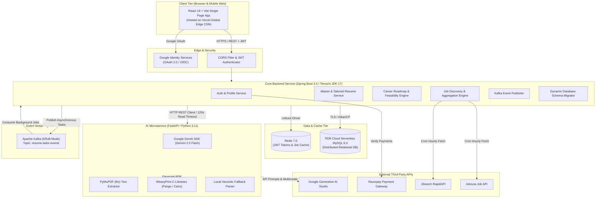
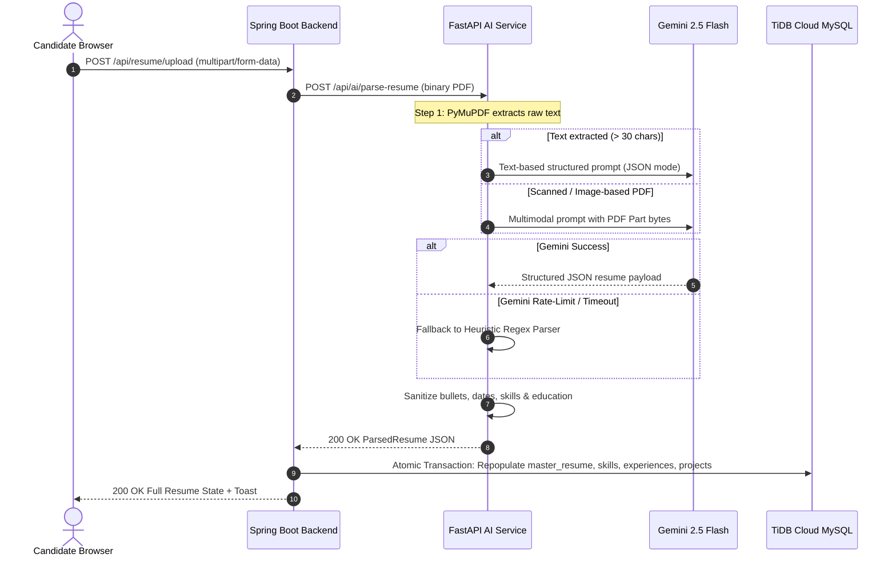
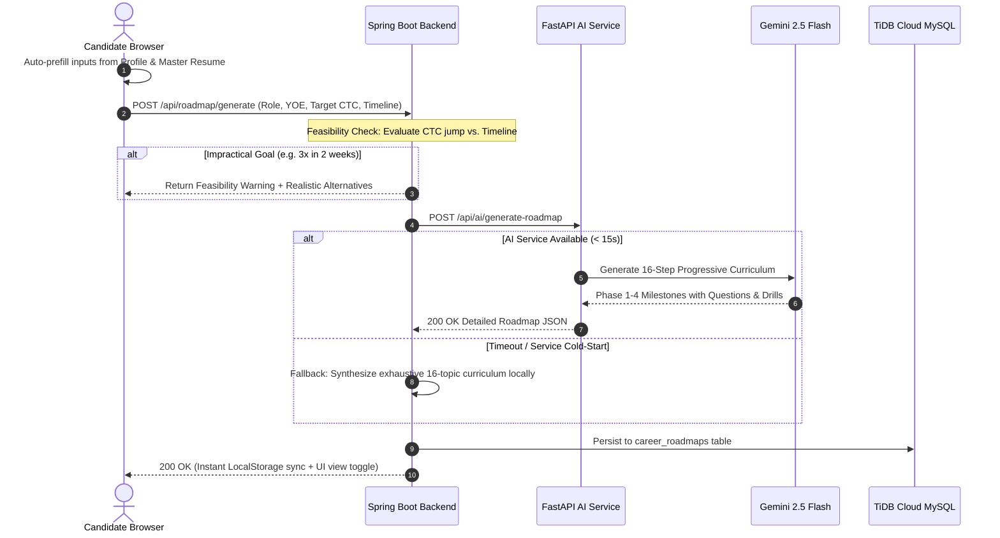
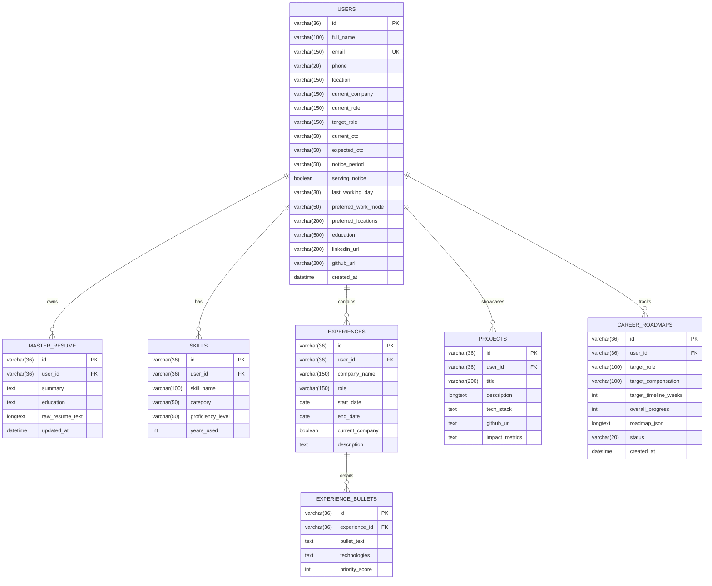

# CrackIt — System Architecture, HLD & LLD Interview Guide

> **Target Audience**: Senior Backend / Full-Stack Software Engineering Interviews (Java/Spring Boot, Distributed Systems, Python AI Microservices, Cloud Architecture).

---

## Table of Contents
1. [Executive Summary & Core Requirements](#1-executive-summary--core-requirements)
2. [High-Level Design (HLD)](#2-high-level-design-hld)
   - [System Architecture (C4 Model)](#21-system-architecture)
   - [Polyglot Microservices Rationale](#22-polyglot-microservices-rationale)
   - [End-to-End Data Flows](#23-end-to-end-data-flows)
   - [Data & State Tier Architecture](#24-data--state-tier-architecture)
   - [Asynchronous Event-Driven Architecture (Kafka)](#25-asynchronous-event-driven-architecture-kafka)
3. [Low-Level Design (LLD)](#3-low-level-design-lld)
   - [Database Schema & ER Model](#31-database-schema--er-model)
   - [Software Design Patterns Applied](#32-software-design-patterns-applied)
   - [Core Subsystem Deep Dives](#33-core-subsystem-deep-dives)
     - [A. ATS-Compliant PDF Generation Engine](#a-ats-compliant-pdf-generation-engine)
     - [B. Multi-Tier Fault-Tolerant Resume Parsing Engine](#b-multi-tier-fault-tolerant-resume-parsing-engine)
     - [C. 16-Step Progressive Roadmap & Reality Engine](#c-16-step-progressive-roadmap--reality-engine)
     - [D. Dynamic Database Schema Migrator](#d-dynamic-database-schema-migrator)
   - [API Contracts & Payload Definitions](#34-api-contracts--payload-definitions)
4. [Production Engineering & Resilience](#4-production-engineering--resilience)
   - [Cold Starts & Connection Pool Optimization](#41-cold-starts--connection-pool-optimization)
   - [Idempotency & Partial-Failure Handling](#42-idempotency--partial-failure-handling)
5. [Interview Master Cheat Sheet](#5-interview-master-cheat-sheet)

---

## 1. Executive Summary & Core Requirements

**CrackIt** is an AI-powered career accelerator and interview preparation platform. It automates:
1. **Dynamic Job Discovery**: Scheduled aggregation and deduplication from international job APIs (Adzuna, JSearch).
2. **Context-Aware ATS Resume Tailoring**: Comparing raw Job Descriptions (JDs) against candidate master resumes to extract keyword gaps, calculate match scores, and generate tailored, single-page ATS-compliant resumes.
3. **Structured 16-Step Career Roadmaps**: Step-by-step progressive syllabi with feasibility checks against impossible candidate goals.
4. **AI Mock Interview Coaching**: Conversational behavioral and technical interview prep based on target roles.

### Non-Functional Requirements (NFRs)
- **High Availability & Zero Downtime**: Production services containerized and deployed across global Edge CDNs (Vercel) and container platforms (Render).
- **Sub-Second Interactive Latency**: Instant client hydration via local storage; asynchronous decoupling for long-running LLM tasks (>10s).
- **ATS Scanner Compliance**: Strictly single-column, standard semantic markup, machine-readable text without tables or multi-column canvas elements.
- **Fail-Safe Fault Tolerance**: 3-tier fallback architecture preventing any single point of failure (LLM rate limits, network timeouts, database schema discrepancies).

---

## 2. High-Level Design (HLD)

### 2.1 System Architecture



---

### 2.2 Polyglot Microservices Rationale

A common interview question: *"Why did you split the system into Spring Boot and FastAPI instead of building everything in one language?"*

| Dimension | Spring Boot 3.4 (Java 17) | FastAPI (Python 3.11) | Architectural Justification |
| :--- | :--- | :--- | :--- |
| **Primary Responsibility** | Core business logic, authentication, transactional data, payments, scheduling, job scraping. | LLM prompting, multimodal PDF parsing, WeasyPrint headless PDF compiling. | Separation of transactional integrity from heavy AI/document computing. |
| **Concurrency & Threading** | Virtual / Platform Threads via Embedded Tomcat; high-throughput ACID transactions. | Asyncio event loop with non-blocking I/O. | Java handles hundreds of concurrent user requests; Python processes compute-heavy document pipelines. |
| **Ecosystem & Libraries** | Spring Security, Spring Data JPA, Hibernate, Kafka, HikariCP. | Official Google GenAI SDK, PyMuPDF (`fitz`), WeasyPrint (libcairo/libpango). | Python has native C-bindings for PDF rendering and the latest AI SDKs; Java provides enterprise-grade transactional scaffolding. |
| **Scaling & Resource Profile** | High memory baseline (~300MB), CPU efficient. | Low memory baseline (~90MB), CPU burst-heavy during PDF compiles. | Independent scaling prevents heavy WeasyPrint PDF compiles from starving core database threads. |

---

### 2.3 End-to-End Data Flows

#### Flow 1: Resume Upload & Resilient Ingestion


#### Flow 2: 16-Topic Progressive Roadmap Synthesis & Feasibility


---

### 2.4 Data & State Tier Architecture

The persistence layer uses a hybrid cloud model:
- **TiDB Cloud Serverless (Distributed MySQL 8.0)**:
  - Distributed storage with horizontal scalability.
  - Full ACID compliance with Raft consensus.
  - Escaped column identifiers (e.g. `` `current_role` ``, `` `role` ``) to prevent MySQL 8.0 reserved keyword collisions.
- **Redis 7.0 In-Memory Cache**:
  - Token blacklisting and session validation.
  - Job search result caching (`discoveredJobs` key space, 1-hour TTL).
- **Client Local Storage**:
  - `crackit:active_roadmap`: Instant hydration eliminating blank screen flickers during network latency or tab switching.

---

### 2.5 Asynchronous Event-Driven Architecture (Kafka)

For high-latency AI operations (such as bulk resume tailoring across 50 discovered jobs):
- **Topic**: `resume-tailor-events`
- **Partitions**: 3 partitions keyed by `userId` to guarantee strict chronological processing per candidate while allowing parallel execution across candidates.
- **Consumer Group**: `crackit-ai-worker-group` with auto-offset commit enabled after successful database persistence.
- **Backpressure Protection**: Decouples incoming web request traffic from downstream Gemini API rate limits (15 RPM free-tier threshold).

---

## 3. Low-Level Design (LLD)

### 3.1 Database Schema & ER Model



---

### 3.2 Software Design Patterns Applied

| Pattern | Component | Concrete Implementation |
| :--- | :--- | :--- |
| **Strategy & Fallback Pattern** | `ResumeParseService` & `RoadmapService` | Primary strategy uses Gemini LLM structured outputs; secondary strategy uses multimodal vision parts; tertiary strategy uses local heuristic regex. |
| **Template Method Pattern** | `ResumePdfService` | Defines the standard ATS layout structure (`_header_html()`, `_skills_html()`, `_exp_html()`, `_proj_html()`, `_edu_html()`) while allowing concrete styling variations. |
| **Facade Pattern** | `AiServiceClient` & `AiIntegrationService` | Encapsulates complex HTTP multipart serialization, JSON marshaling, and error mapping between Spring Boot and FastAPI into clean domain methods. |
| **Idempotent Self-Healing Migration** | `DatabaseSchemaMigrator` | Implements `ApplicationRunner` and `@PostConstruct` with `information_schema` inspection to dynamically execute `ALTER TABLE ... ADD COLUMN` before traffic hits the application. |
| **Observer Pattern** | `CustomEvent('crackit:toast')` | Decoupled UI messaging system where child components dispatch global toast events without prop drilling. |

---

### 3.3 Core Subsystem Deep Dives

#### A. ATS-Compliant PDF Generation Engine
- **Engine**: WeasyPrint 68.1 (Python C-bindings over Cairo and Pango).
- **Single-Column Constraint**: Multi-column resumes break legacy ATS parsers (e.g. Taleo, Workday) which read horizontally across column boundaries. CrackIt strictly enforces a single-column flow.
- **Canonical Skill Precedence**: ATS parsers score keyword density based on category hierarchy. CrackIt enforces:
  $$\text{Languages} \rightarrow \text{Backend} \rightarrow \text{Databases} \rightarrow \text{Caching} \rightarrow \text{Messaging} \rightarrow \text{Cloud/DevOps} \rightarrow \text{Tools} \rightarrow \text{Core Concepts} \rightarrow \text{Other}$$
- **Typography & Layout**: Standard 10.5pt typography, 0.5-inch margins, uppercase semantic headings with CSS border dividers (`border-bottom: 1px solid #111`), right-aligned dates, and bulleted `<li>` accomplishment points.

#### B. Multi-Tier Fault-Tolerant Resume Parsing Engine
1. **Tier 1 (PyMuPDF Text Stream)**: Extracts clean Unicode text streams in <50ms.
2. **Tier 2 (Gemini Multimodal Fallback)**: If text extraction yields <30 characters (scanned or image-based PDF), sends raw PDF bytes directly to Gemini 2.5 Flash via `types.Part.from_bytes(data=pdf_bytes, mime_type="application/pdf")`.
3. **Tier 3 (Local Heuristic Regex Fallback)**: If the LLM service hits quota or network failure, local regex extractors parse emails, phone numbers, known technology keywords, and summary sections so the endpoint **never returns a 500 error**.

#### C. 16-Step Progressive Roadmap & Reality Engine
- **4 Distinct Phases**:
  1. *Phase 1: Core Mechanics & Engineering Fundamentals* (Steps 1–4)
  2. *Phase 2: Framework Internals & Data Layer Mastery* (Steps 5–8)
  3. *Phase 3: High-Scale Distributed Systems & Messaging* (Steps 9–12)
  4. *Phase 4: Production Resilience, System Design & Architecture* (Steps 13–16)
- **Feasibility Algorithm**:
  $$\text{Jump Multiplier} = \frac{\text{Target CTC}}{\text{Current CTC}}$$
  - If $\text{Jump Multiplier} \ge 2.5\times$ and $\text{Timeline} \le 4\text{ weeks}$, flag as **Impractical**.
  - Recommendation engine suggests a realistic timeline (minimum 12–16 weeks) or a progressive stepping-stone role.

#### D. Dynamic Database Schema Migrator
- Located in [`DatabaseSchemaMigrator.java`](file:///home/stpl/Crackit/crackit/src/main/java/com/crackit/common/config/DatabaseSchemaMigrator.java).
- Connects directly to the `DataSource` on bootstrap before Tomcat accepts traffic.
- Inspects `information_schema.COLUMNS` to safely execute `ALTER TABLE ... ADD COLUMN IF NOT EXISTS`, preventing `1054 Unknown column` SQL errors in distributed cloud databases.

---

### 3.4 API Contracts & Payload Definitions

#### `POST /api/ai/parse-resume` (FastAPI)
- **Request**: `multipart/form-data` with `file: binary (PDF)`.
- **Response**:
```json
{
  "summary": "Backend Software Engineer with 4+ years...",
  "skills": [
    { "skillName": "Java", "category": "Languages", "proficiencyLevel": "Expert", "yearsUsed": 4 },
    { "skillName": "Spring Boot", "category": "Backend", "proficiencyLevel": "Expert", "yearsUsed": 4 }
  ],
  "experiences": [
    {
      "companyName": "Skilrock Technologies",
      "role": "Senior Software Engineer",
      "startDate": "2022-06-01",
      "endDate": null,
      "currentCompany": true,
      "description": "",
      "bullets": [
        { "bulletText": "Architected multi-step transactional workflows...", "technologies": "Kafka, Java" }
      ]
    }
  ],
  "projects": [
    {
      "title": "CrackIt Platform",
      "description": "Built full-stack AI career platform...",
      "techStack": "Java, Spring Boot, React, FastAPI, MySQL, Kafka",
      "bullets": [
        { "bulletText": "Engineered automated job discovery engine...", "technologies": "Adzuna, JSearch" }
      ]
    }
  ],
  "education": [
    { "degree": "B.Tech in Computer Science", "institution": "IIMT", "year": "2020", "score": "8.5 CGPA" }
  ]
}
```

---

## 4. Production Engineering & Resilience

### 4.1 Cold Starts & Connection Pool Optimization
- **Challenge**: Render free-tier containers spin down after 15 minutes of inactivity. Initial requests faced 10–14s latency.
- **Mitigation 1 (Client Pre-Warming)**: On loading the login/signup page, the frontend initiates a non-blocking background `GET /api/health`. While the user types credentials, the backend finishes cold boot.
- **Mitigation 2 (HikariCP Tuning)**:
  ```yaml
  spring.datasource.hikari:
    minimum-idle: 2
    maximum-pool-size: 10
    idle-timeout: 30000
    connection-timeout: 20000
    max-lifetime: 1800000
  ```
- **Mitigation 3 (RestTemplate Timeouts)**:
  - Connect Timeout: 60s (accommodates AI container wake-up).
  - Read Timeout: 120s (accommodates multi-token LLM generation).

### 4.2 Idempotency & Partial-Failure Handling
- **Resume Parsing**: Atomic transaction (`@Transactional`) ensures old skills, experiences, and projects are only replaced after full parsing success.
- **Kafka Consumers**: Event messages carry idempotency keys (`userId + timestamp`) to prevent duplicate processing if a consumer rebalances.

---

## 5. Interview Master Cheat Sheet

### Q1: "Give me an elevator pitch of CrackIt's architecture."
> *"CrackIt is a cloud-native, polyglot microservices platform. We have a React SPA hosted on Vercel's Edge CDN, communicating with a Spring Boot 3.4 core API gateway. The Spring Boot backend handles transactional business logic, user profiles, payments, and distributed MySQL persistence via TiDB Serverless. Heavy compute tasks—like Gemini LLM structured parsing and WeasyPrint PDF compilation—are offloaded to a specialized Python/FastAPI microservice. For long-running asynchronous workflows, we decouple services using Apache Kafka."*

### Q2: "How did you ensure your generated resumes are truly ATS-compliant?"
> *"Many resume builders use HTML canvas or multi-column flex layouts which cause ATS parsers like Workday and Taleo to read text across columns or fail to parse text altogether. In CrackIt, we implemented a single-column layout rendered via WeasyPrint into pure searchable PDF text. We enforce strict canonical skill category ordering (Languages first, then Frameworks, Databases, Caching, Messaging, DevOps), format all accomplishments as semantic bullet points (`<li>`), and include dedicated uppercase section headers with ISO standard dates."*

### Q3: "How do you handle failures when calling the Gemini LLM?"
> *"We implemented a 3-tier fallback strategy. First, we use Gemini 2.5 Flash with structured JSON output and temperature 0.2. If text extraction fails because the resume is an image or scan, we fallback to multimodal byte transmission. If the Gemini API experiences rate limiting or timeouts, our service automatically drops back to a local heuristic regex parser using PyMuPDF. This guarantees that user uploads never crash with 500 errors."*

### Q4: "What was a difficult database bug you encountered and how did you resolve it?"
> *"During production deployment on TiDB Cloud Serverless, Hibernate's standard `ddl-auto: update` failed to add newly introduced columns to existing tables, causing `SQL Error 1054: Unknown column 'education' in field list`. Because TiDB handles schema metadata slightly differently than standard MySQL, Hibernate skipped the schema alter. I solved this by building a dedicated `DatabaseSchemaMigrator` component running at startup with JDBC. It queries `information_schema.COLUMNS` and executes idempotent `ALTER TABLE` statements before any incoming HTTP traffic is accepted."*
