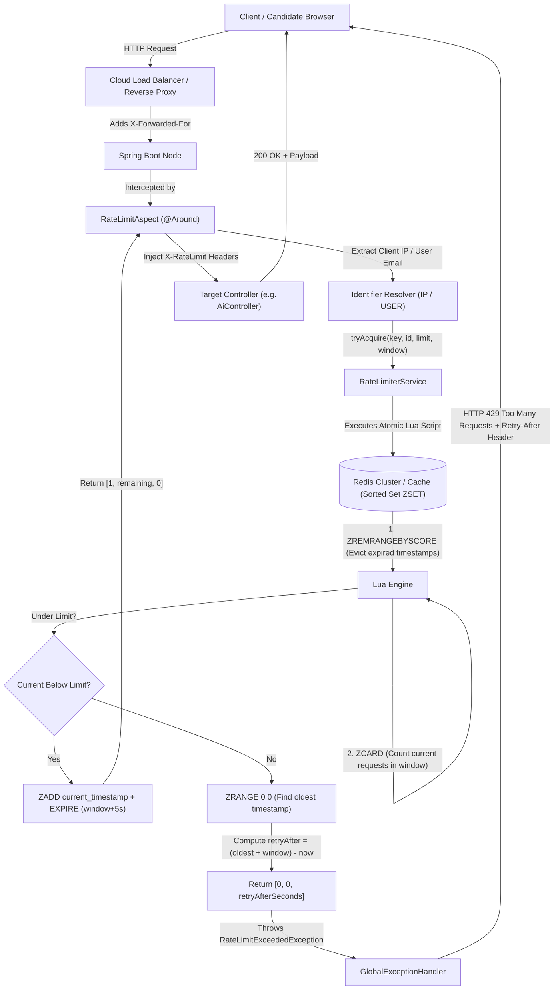

# Distributed Rate Limiting Architecture Guide
## Redis Sliding Window Log with Atomic Lua Execution

This guide provides a comprehensive architectural breakdown of CrackIt's production-grade distributed rate limiting engine. It details why distributed rate limiting is critical for AI-powered SaaS platforms, compares rate limiting algorithms, explains the Redis Sorted Set (`ZSET`) mechanics, outlines fail-open resilience patterns, and provides staff-level interview preparation questions.

---

## 1. Why Distributed Rate Limiting is Critical

In modern cloud environments, applications run as multiple stateless containers (e.g., Spring Boot instances on Kubernetes, Render, or AWS ECS) behind a load balancer. Naive in-memory rate limiting (like `ConcurrentHashMap` or Guava `RateLimiter`) fails in multi-instance architectures because each instance only sees a fraction of the traffic:

```
[Attacker] ---> [Load Balancer] ---> Node 1 (Allows 5 req/min)
                                ---> Node 2 (Allows 5 req/min)
                                ---> Node 3 (Allows 5 req/min)
Total Requests Allowed = 15 req/min (3x Intended Limit!)
```

### The 3 Production Catastrophes Thwarted:
1. **Gemini LLM Quota Exhaustion & Bill Shock**:
   - CrackIt leverages Gemini 2.5 Flash for JD gap analysis, resume tailoring, and mock interview coaching.
   - A single automated script hitting `/api/ai/jobs/:jobId/tailor-resume` 500 times in 30 seconds would instantly exhaust the Gemini API quota, locking out all legitimate candidates and racking up unexpected API bills.
2. **BCrypt CPU Starvation Denial-of-Service (DoS)**:
   - CrackIt hashes passwords with BCrypt (cost factor 10), which intentionally takes ~80–120ms of heavy CPU time per verification.
   - Without IP rate limiting on `/api/auth/login` and `/api/auth/signup`, an attacker sending 100 concurrent requests/sec will pin all CPU cores to 100%, causing the entire JVM to freeze and drop legitimate user traffic.
3. **Upstream Job Board IP Bans**:
   - Automated scrapers and job search queries hitting third-party providers (e.g., Adzuna) risk permanent IP bans if client bursts are not throttled.

---

## 2. Algorithm Comparison: Why Sliding Window Log?

| Algorithm | Pros | Cons | CrackIt Decision |
| :--- | :--- | :--- | :--- |
| **Fixed Window Counter** | Simple, `O(1)` memory (single Redis integer key). | **Boundary Burst Vulnerability**: Allows 2x limit at window edges (e.g., 5 requests at 00:59 + 5 requests at 01:00 = 10 requests in 2 seconds). | ❌ Rejected for AI & Auth routes. |
| **Sliding Window Counter (Approximation)** | Low memory footprint (`O(1)`), smooths bursts. | Mathematically approximate (assumes uniform distribution over previous window). | ❌ Rejected for strict security tiers. |
| **Token Bucket** | Handles legitimate bursts gracefully, refills smoothly. | Cannot pinpoint exact `Retry-After` seconds when tokens are depleted. Requires managing floating-point token replenishment. | ⚠️ Excellent for general network throttling, but less granular for HTTP 429 response headers. |
| **Sliding Window Log (Redis ZSET)** | **100% Exact & Atomic**. Zero boundary bursts. Accurately computes exact millisecond `Retry-After` header. | Stores individual request timestamps in a Redis Sorted Set (`O(M)` memory where M = limit). |  **Adopted across all CrackIt high-risk routes.** |

---

## 3. End-to-End System Architecture



---

## 4. Atomic Redis Lua Script Breakdown

The core file `src/main/resources/scripts/sliding_window_rate_limit.lua` executes atomically on Redis:

```lua
-- Keys:
-- KEYS[1]: Rate limit key (e.g. ratelimit:auth_login:192.168.1.1)
-- Arguments:
-- ARGV[1]: Current timestamp in ms (now)
-- ARGV[2]: Window size in ms (window)
-- ARGV[3]: Max requests allowed (limit)
-- ARGV[4]: Unique member identifier (<now>-<UUID>)

local key = KEYS[1]
local now = tonumber(ARGV[1])
local window = tonumber(ARGV[2])
local limit = tonumber(ARGV[3])
local member = ARGV[4]

local clearBefore = now - window

-- Step 1: Remove all requests older than the sliding window boundary
redis.call('ZREMRANGEBYSCORE', key, 0, clearBefore)

-- Step 2: Count requests remaining in the current sliding window
local currentRequests = redis.call('ZCARD', key)

-- Step 3: Check whether the request is within capacity
if currentRequests < limit then
    -- Allowed: record this request timestamp
    redis.call('ZADD', key, now, member)
    -- Extend key TTL with a safety buffer of 5 seconds beyond the window
    local ttlSeconds = math.ceil((window + 5000) / 1000)
    redis.call('EXPIRE', key, ttlSeconds)
    return {1, limit - currentRequests - 1, 0}
else
    -- Denied: calculate exact retry-after seconds until the oldest request slides out
    local oldest = redis.call('ZRANGE', key, 0, 0, 'WITHSCORES')
    local retryAfterMs = window
    if oldest and #oldest >= 2 then
        local oldestScore = tonumber(oldest[2])
        local expiresAt = oldestScore + window
        if expiresAt > now then
            retryAfterMs = expiresAt - now
        else
            retryAfterMs = 1000
        end
    end
    local retryAfterSeconds = math.max(1, math.ceil(retryAfterMs / 1000))
    return {0, 0, retryAfterSeconds}
end
```

### Why This Design is Optimal:
1. **Atomicity**: In distributed systems, a `GET` followed by a `SET` creates race conditions where 10 concurrent requests read `count = 4` and all 10 proceed. Redis Lua scripts run single-threaded and atomically, preventing any interleaving.
2. **Automatic Garbage Collection**: `EXPIRE key (window + 5s)` ensures that when a client stops making requests, Redis automatically purges the key and frees memory.
3. **Exact `Retry-After` Header Calculation**: Rather than giving an arbitrary retry time (e.g. always 60s), the script looks up the oldest score in the set via `ZRANGE key 0 0 WITHSCORES`. If that request was made at second `t=12` in a 60s window and `now` is `t=50`, the slot frees up at `t=72`, so `Retry-After = 22s`.

---

## 5. Resilience: The Fail-Open Pattern

A rate limiter must **never take down legitimate business traffic** when the caching infrastructure experiences transient hiccups or failovers.

In `RateLimiterService.java`:
```java
try {
    List<?> scriptResult = stringRedisTemplate.execute(...);
    // Parse result...
} catch (Exception e) {
    // Fail-Open: Redis downtime or network split allows the request through
    log.warn("Redis rate limiter execution failed for key '{}': {}. Failing open to maintain service availability.",
            redisKey, e.getMessage());
    return RateLimitResult.failOpen(limit, durationSeconds);
}
```

- If Redis is rebooted, temporarily partitioned, or times out, the service logs a warning and returns `allowed = true`.
- **System Design Trade-off**: Availability > Strict Rate Enforcement during infrastructure outages.

---

## 6. Implementation & Controller Annotations

### Applied Rate Limits in CrackIt:

| Controller | Endpoint | Key | Limit | Window | Identification Strategy |
| :--- | :--- | :--- | :--- | :--- | :--- |
| `AuthController` | `POST /api/auth/signup` | `auth_signup` | 5 req | 60s | `RateLimitType.IP` |
| `AuthController` | `POST /api/auth/login` | `auth_login` | 10 req | 60s | `RateLimitType.IP` |
| `AuthController` | `POST /api/auth/google` | `auth_google` | 10 req | 60s | `RateLimitType.IP` |
| `AiController` | `POST /api/ai/quick-scan` | `ai_quick_scan` | 5 req | 60s | `RateLimitType.USER_OR_IP` |
| `AiController` | `POST /api/ai/jobs/:jobId/analyze` | `ai_job_analyze` | 10 req | 60s | `RateLimitType.USER_OR_IP` |
| `AiController` | `POST /api/ai/jobs/:jobId/tailor-resume` | `ai_tailor_resume` | 10 req | 60s | `RateLimitType.USER_OR_IP` |
| `InterviewPrepController` | `POST /api/ai/jobs/:jobId/interview-prep` | `interview_prep_generate` | 10 req | 60s | `RateLimitType.USER_OR_IP` |
| `InterviewPrepController` | `POST /api/ai/jobs/:jobId/chat` | `interview_chat` | 20 req | 60s | `RateLimitType.USER_OR_IP` |

### HTTP Standard Response Headers
When allowed:
```http
HTTP/1.1 200 OK
X-RateLimit-Limit: 10
X-RateLimit-Remaining: 8
X-RateLimit-Reset: 1727181600
```

When rate limited:
```http
HTTP/1.1 429 Too Many Requests
Retry-After: 42
X-RateLimit-Limit: 10
X-RateLimit-Remaining: 0

{
  "timestamp": "2026-09-24T12:50:00",
  "error": "RATE_LIMIT_EXCEEDED",
  "message": "Rate limit exceeded. Maximum 10 requests allowed every 60s. Please retry in 42s.",
  "limit": 10,
  "windowSeconds": 60,
  "retryAfterSeconds": 42
}
```

---

## 7. Staff-Level System Design Interview Questions

### Q1: Why not use Redis `INCR` with `EXPIRE` (Fixed Window)?
**Model Answer**:
"A simple `INCR` key tied to a fixed minute counter (e.g. `key = ratelimit:user:2026-09-24-12:00`) suffers from the **Boundary Burst Vulnerability**. If the limit is 100 requests per minute, a client can send 100 requests at 12:00:59 and another 100 requests at 12:01:00. Over that 2-second interval, 200 requests pass through, which is twice the intended capacity and can overwhelm downstream databases. Our Sliding Window Log with Sorted Sets continuously evicts entries older than `now - 60,000ms`, guaranteeing that across *any* rolling 60-second window, no more than 100 requests ever execute."

### Q2: How does your rate limiter handle clients behind shared NATs or Corporate Proxies?
**Model Answer**:
"In unauthenticated scenarios, multiple distinct users may share a single public IP due to Corporate NATs or university networks. To prevent one user from starving another:
1. For authenticated routes, CrackIt uses `RateLimitType.USER` (or `USER_OR_IP`), identifying users by their validated JWT email/subject rather than their IP address.
2. For unauthenticated routes, our IP resolver parses `X-Forwarded-For` by extracting the first comma-separated client IP, and prioritizes Cloudflare's `CF-Connecting-IP` if deployed behind Cloudflare CDN.
3. For enterprise deployments, we can augment the client key with browser fingerprinting or CSRF session tokens to disambiguate behind a shared NAT."

### Q3: What happens when Redis experiences a master failover or network split?
**Model Answer**:
"We implement a **Fail-Open Strategy**. If the Redis call times out or throws a `RedisConnectionFailureException`, our `RateLimiterService` catches the exception, logs a warning with the offending key, and returns `allowed = true`.
In system design, rate limiting is a protection mechanism, not the core business transaction. Crashing user checkout, login, or AI tailoring because the rate limiter is unavailable violates high-availability principles. If stricter security is required (e.g. for payment transfers), we can selectively configure critical endpoints to **Fail-Closed** while keeping AI and public endpoints **Fail-Open**."

### Q4: If you scale to 100,000 requests per second, will Sorted Sets (`ZSET`) cause Redis memory or CPU bottlenecks?
**Model Answer**:
"At very high scale (100k+ QPS), storing individual timestamp members in Sorted Sets requires `O(M)` memory per active user. To optimize at massive scale:
1. **Sliding Window Counter (Weighted Moving Average)**: We can use two counters (current minute and previous minute) with weight formula: `count = prev_count * ((window - elapsed) / window) + curr_count`. This gives `O(1)` memory (2 small integers per user) and ~99.9% accuracy.
2. **Redis Cluster Sharding**: Redis keys are partitioned using CRC16 hashes of the rate limit key. Because the Lua script only touches a single key (`KEYS[1]`), every rate limit operation runs within a single shard, achieving linear horizontal scaling across Redis nodes without cross-slot issues."

### Q5: How do you prevent clock drift between application nodes and Redis?
**Model Answer**:
"In a distributed cluster, application servers may have slight clock variations due to NTP synchronization drift. In our Lua script, while the client timestamp is passed as `ARGV[1]`, for strict sub-millisecond precision, Redis provides `redis.call('TIME')`, which returns the canonical server time directly from the Redis host: `local serverTime = redis.call('TIME')`. This eliminates any vulnerability where a compromised client or drifting Spring Boot instance manipulates the request timestamp to bypass rate limiting."
