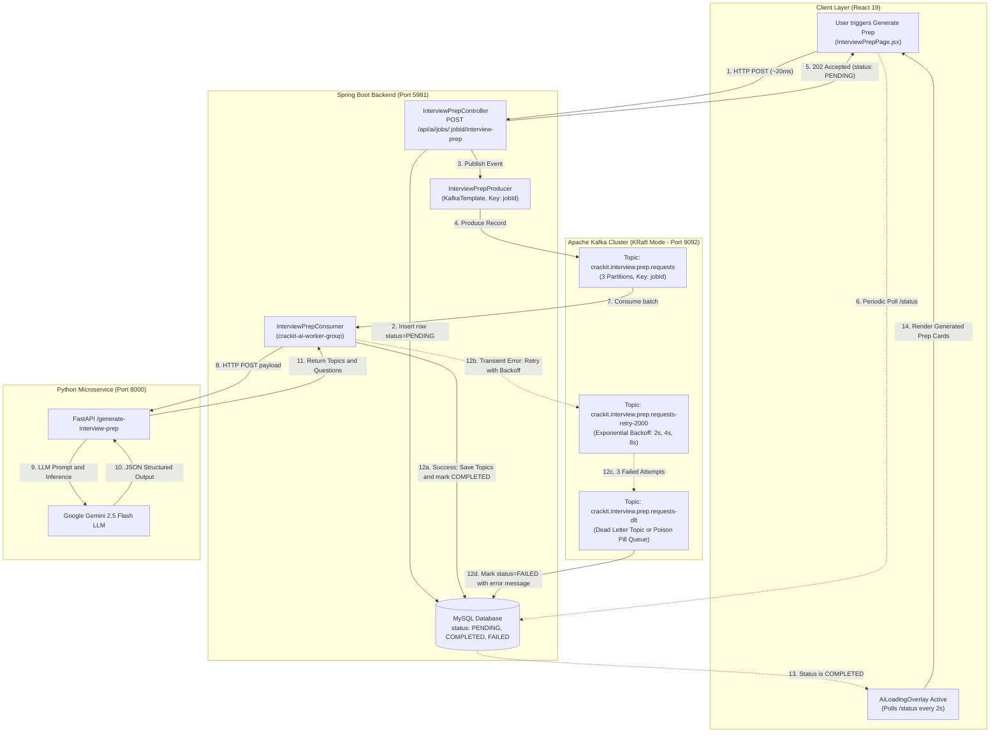

# Apache Kafka Event-Driven Architecture Guide

> **Project**: CrackIt (AI-Powered Career & Interview Preparation Platform)  
> **Author / Engineer Reference**: CrackIt Engineering Team  
> **Use Case**: Asynchronous, Resilient Processing of Heavy LLM / AI Workloads  
> **Technology Stack**: Apache Kafka 3.7+ (KRaft Mode), Spring Boot 3 (Spring Kafka), Python FastAPI, Google Gemini 2.5 Flash, MySQL, React 19  

---

## Table of Contents
1. [Executive Summary](#1-executive-summary)
2. [End-to-End System Architecture Diagram](#2-end-to-end-system-architecture-diagram)
3. [The Core Problem: Why Kafka Was Needed](#3-the-core-problem-why-kafka-was-needed)
4. [What Kafka Solved in CrackIt](#4-what-kafka-solved-in-crackit)
5. [In-Depth Implementation Details](#5-in-depth-implementation-details)
   - [Modern KRaft Architecture (No ZooKeeper)](#51-modern-kraft-architecture-no-zookeeper)
   - [Topic Design & Partitioning Strategy](#52-topic-design--partitioning-strategy)
   - [Producer Architecture & Delivery Guarantees](#53-producer-architecture--delivery-guarantees)
   - [Consumer Group, Non-Blocking Retries & Dead Letter Queue (DLQ)](#54-consumer-group-non-blocking-retries--dead-letter-queue-dlq)
   - [Database Status Lifecycle & Polling Contract](#55-database-status-lifecycle--polling-contract)
   - [Graceful Dev Fallback Toggle](#56-graceful-dev-fallback-toggle)
6. [Architectural Comparison: Why Kafka vs Alternatives?](#6-architectural-comparison-why-kafka-vs-alternatives)
7. [Pros, Cons, and Trade-offs](#7-pros-cons-and-trade-offs)
8. [Senior / Staff Engineer Interview Q&A (Top 10 Questions)](#8-senior--staff-engineer-interview-qa-top-10-questions)

---

## 1. Executive Summary

In CrackIt, several core features rely on large language models (Google Gemini 2.5 Flash via a Python FastAPI microservice):
- **Deep Interview Preparation**: Analyzes candidate resume (skills, bullet points, past projects) against job descriptions to generate 8-15 technical, behavioral, and situational questions with suggested answers.
- **Job Description (JD) Analysis & ATS Keyword Scoring**: Ingests multi-page job postings, extracts core competencies, computes match percentages, and identifies missing skills.

Generating these comprehensive artifacts takes **8 to 25 seconds** per request due to LLM token generation latency. Under synchronous HTTP, each request blocked an application server thread for the entire duration, threatening system-wide outages under concurrent user traffic.

We introduced **Apache Kafka** to transform this heavy synchronous bottleneck into an **asynchronous, event-driven, resilient streaming pipeline**.

---

## 2. End-to-End System Architecture Diagram



---

## 3. The Core Problem: Why Kafka Was Needed

Before Kafka was implemented, the application operated synchronously:
$$\text{Frontend} \xrightarrow{\text{HTTP}} \text{Spring Boot} \xrightarrow{\text{HTTP}} \text{FastAPI} \xrightarrow{\text{gRPC/HTTP}} \text{Gemini LLM}$$

### 1. The Math of Thread Starvation (Tomcat Collapse)
Spring Boot’s embedded Tomcat container assigns a dedicated worker thread from a pool (default: `server.tomcat.threads.max = 200`) for the entire lifecycle of an incoming HTTP connection.
- Average response time for an interview prep generation: **15 to 20 seconds**.
- If 20 concurrent users request generation: $20 \times 1\text{ thread} = 20\text{ threads}$ locked for 20 seconds.
- If a traffic spike occurs (e.g., 50 users clicking "Generate Prep" simultaneously):
  - 50 worker threads are held hostage waiting for external socket I/O.
  - New incoming requests for fast, lightweight endpoints (e.g., `POST /api/auth/login`, `GET /api/tracker/dashboard`) begin queuing in Tomcat’s accept queue (`server.tomcat.accept-count = 100`).
  - Once the queue fills, Tomcat throws **`Connection refused`** and reverse proxies return **`504 Gateway Timeout`**, causing a cascading platform-wide outage for all users.

### 2. Cascading Failures and Transient LLM Flakiness
Third-party AI APIs like Google Gemini, OpenAI, or Claude are subject to:
- Transient network socket timeouts.
- **HTTP 429 Too Many Requests** (Rate Limiting / Quota exhaustion per minute).
- Model cold starts and regional latency spikes.

In a synchronous architecture, a single 429 quota blip causes an uncaught HTTP 500 error on the frontend. The candidate's generated prep is lost, their state is broken, and they must click the button again, adding even *more* traffic to an already rate-limited API.

### 3. Lack of Backpressure (Traffic Spikes Barraging the AI API)
If 100 users submit requests at 9:00 AM, a synchronous server forwards all 100 requests directly to Gemini at once. Gemini's tier quota rejects 80% of them with `RESOURCE_EXHAUSTED`. There is no buffer to absorb the spike and drain it at a controlled rate.

---

## 4. What Kafka Solved in CrackIt

| Bottleneck | Without Kafka (Synchronous) | With Kafka (Event-Driven) |
| :--- | :--- | :--- |
| **User Response Time** | 15,000ms – 25,000ms (browser blocked) | **< 30ms** (returns `202 Accepted` immediately) |
| **Tomcat Thread Occupancy** | Thread held for 20 seconds per request | Thread released in **~15ms** after pushing event to Kafka buffer |
| **System Capacity** | Crumbles under > 15-20 concurrent AI requests | Easily handles **thousands of queued requests** in Kafka partitions |
| **Transient Error Handling** | Instant hard crash to user; no retries | Automatic **Non-blocking Retries** with exponential backoff (2s, 4s, 8s) |
| **Rate Limit / Quota Protection**| Spikes directly hit Gemini API causing 429s | Consumers read at a controlled pace (**Natural Backpressure**) |
| **Poison Pill Messages** | Crashes worker threads repeatedly | Routed automatically to **Dead Letter Topic (DLT)** |
| **Decoupling** | Spring Boot tightly coupled to AI service health | Producers and Consumers are completely decoupled |

---

## 5. In-Depth Implementation Details

### 5.1 Modern KRaft Architecture (No ZooKeeper)
Historically, Apache Kafka required an external Apache ZooKeeper ensemble to manage broker metadata, topic configurations, partition leader elections, and consumer group coordination.

In CrackIt, we deployed Kafka using **KRaft (Kafka Raft Metadata Mode)** via `docker/docker-compose.kafka.yml`:
- **Single Process / Zero ZooKeeper Overhead**: Eliminates the synchronization lag between ZooKeeper and Kafka brokers.
- **Raft Consensus Protocol**: Metadata is managed as an internal, replicated Kafka topic (`@metadata`), ensuring instant leader election and partition rebalances.
- **Lightweight Footprint**: Spun up instantly via Docker:
  ```bash
  docker compose -f docker/docker-compose.kafka.yml up -d
  ```
- **Included Kafka UI**: A real-time visual web dashboard at `http://localhost:8085` allows inspecting topic offsets, partitions, message payloads, and consumer lag.

### 5.2 Topic Design & Partitioning Strategy

#### 1. Main Ingestion Topic: `crackit.interview.prep.requests`
- **Partitions**: 3
- **Replication Factor**: 1 (local dev) / 3 (production cluster across AZs)
- **Key Strategy**: `record.key = event.getJobId()`
  - **Why Partition Key Matters**: In Kafka, all messages with the same partition key are guaranteed to land on the **exact same partition** (`hash(key) % num_partitions`).
  - **Guarantee**: If a candidate clicks "Generate" and immediately clicks "Regenerate" for the same Job ID, both events land on the same partition. Kafka processes them in strict chronological order, completely preventing race conditions and stale overwrites.

#### 2. Dead Letter Topic: `crackit.interview.prep.requests-dlt`
- **Partitions**: 3
- Serves as the quarantine queue for messages that repeatedly fail across all retry attempts.

### 5.3 Producer Architecture & Delivery Guarantees
Implemented in [`InterviewPrepProducer.java`](file:///home/stpl/Crackit/crackit/src/main/java/com/crackit/kafka/producer/InterviewPrepProducer.java):
```java
ProducerRecord<String, Object> record = new ProducerRecord<>(
    KafkaTopicConfig.INTERVIEW_PREP_TOPIC,
    event.getJobId(), // Partition key
    event
);
record.headers().add(new RecordHeader("X-Correlation-Id", correlationId.getBytes(StandardCharsets.UTF_8)));
CompletableFuture<SendResult<String, Object>> future = kafkaTemplate.send(record);
```

#### Reliability & Idempotence Settings:
- **`spring.kafka.producer.properties.enable.idempotence: true`**:
  - The producer is assigned an internal Producer ID (PID) and attaches a monotonically increasing sequence number to each message batch.
  - Even if a network glitch causes the producer to retry sending a message, the Kafka broker recognizes the duplicate sequence number and writes it to disk **exactly once**.
- **`spring.kafka.producer.acks: all` (or `-1`)**:
  - The broker will only acknowledge the produce request after all in-sync replicas (ISR) have written the record to their local append-only commit logs.
  - Zero data loss guarantee.

### 5.4 Consumer Group, Non-Blocking Retries & Dead Letter Queue (DLQ)
Implemented in [`InterviewPrepConsumer.java`](file:///home/stpl/Crackit/crackit/src/main/java/com/crackit/kafka/consumer/InterviewPrepConsumer.java):
- **Consumer Group**: `crackit-ai-worker-group`
  - In Kafka, partitions are distributed among active consumer instances in the same group. With 3 partitions, we can horizontally scale up to 3 Spring Boot worker pods, each independently draining 1 partition concurrently.
- **Non-Blocking Retry Architecture**:
  ```java
  @RetryableTopic(
      attempts = "3",
      backoff = @Backoff(delay = 2000, multiplier = 2.0, maxDelay = 10000),
      dltTopicSuffix = "-dlt"
  )
  @KafkaListener(topics = KafkaTopicConfig.INTERVIEW_PREP_TOPIC, groupId = "crackit-ai-worker-group")
  public void consumeInterviewPrepRequest(...) { ... }
  ```
  - **Traditional Blocking Retries (Anti-Pattern)**: If a consumer thread sleeps for 10 seconds to retry an API call, partition consumption freezes, consumer lag spikes, and unrelated messages behind it are stalled.
  - **Spring Kafka Non-Blocking Retries (Best Practice)**:
    - If Attempt 1 fails, Spring Kafka forwards the event to a dedicated retry topic (`crackit.interview.prep.requests-retry-2000`) and commits the offset on the main topic immediately.
    - Other healthy messages in the main topic continue processing without delay!
    - The retry topic consumer picks up the record after the 2-second delay. If it fails again, it progresses to Attempt 3 (4-second delay).
- **Dead Letter Handler (`@DltHandler`)**:
  - If all 3 attempts fail (e.g., permanent 400 Bad Request or quota completely depleted), the message is routed to `crackit.interview.prep.requests-dlt`.
  - The `@DltHandler` method updates the MySQL database record:
    ```java
    prep.setStatus(PrepStatus.FAILED);
    prep.setErrorMessage("AI generation failed after 3 retries: " + exception.getMessage());
    interviewPrepRepository.save(prep);
    ```
  - **Result**: The candidate's UI gracefully displays an error alert with a "Retry" button instead of spinning forever in an infinite loading state.

### 5.5 Database Status Lifecycle & Polling Contract
To link asynchronous Kafka events with the synchronous web frontend:
1. **`PrepStatus` Enum**: `PENDING` $\rightarrow$ `IN_PROGRESS` $\rightarrow$ `COMPLETED` / `FAILED`.
2. **REST Contract**:
   - `POST /api/ai/jobs/{id}/interview-prep`:
     - Creates entity with `status = PENDING`.
     - Publishes event to Kafka.
     - Immediately returns `202 Accepted` with payload containing `status: "PENDING"`.
   - `GET /api/ai/jobs/{id}/interview-prep`:
     - Returns entity with current `status` and `errorMessage` (if failed).
3. **Frontend Polling**:
   - In [`InterviewPrepPage.jsx`](file:///home/stpl/Crackit/crackit-ui/src/pages/InterviewPrepPage.jsx), when `status === 'PENDING'` or `'IN_PROGRESS'`, the existing `AiLoadingOverlay` stays active while polling `GET` every 2 seconds.
   - When status transitions to `COMPLETED`, polling stops and the UI smoothly renders the topics.
   - **Zero UI Layout Shifts**: Reuses existing state handlers and glassmorphic designs.

### 5.6 Graceful Dev Fallback Toggle
In [`application.yaml`](file:///home/stpl/Crackit/crackit/src/main/resources/application.yaml):
```yaml
kafka:
  enabled: ${KAFKA_ENABLED:true}
```
If a developer runs CrackIt locally without launching Docker, they can simply set `KAFKA_ENABLED=false`:
- Spring Kafka topic beans and listeners are conditionally omitted.
- [`InterviewPrepService.java`](file:///home/stpl/Crackit/crackit/src/main/java/com/crackit/interview/service/InterviewPrepService.java) automatically detects `Optional.empty()` for the producer and falls back to clean synchronous execution.
- **Zero broken local setups!**

---

## 6. Architectural Comparison: Why Kafka vs Alternatives?

| Dimension | Apache Kafka | RabbitMQ | Redis Streams / Celery | AWS SQS / SNS |
| :--- | :--- | :--- | :--- | :--- |
| **Architecture Model** | **Distributed Commit Log** (Pulls from offset) | **Message Broker** (Pushes to consumers, deletes on ack) | **In-Memory Data Store** with stream data type | **Cloud-Managed Queue** |
| **Throughput** | **100k - 1M+ msgs/sec** (sequential disk append, zero-copy `sendfile`) | 20k - 50k msgs/sec (RAM / Erlang queue overhead) | 50k - 100k msgs/sec (limited by single-thread Redis RAM) | Moderate (throttled by HTTP API latency) |
| **Message Retention & Replay**| **Configurable (days/years)**. Messages persist after consumption; offsets can be rewound to reprocess past events. | **Destructive**. Once acked, message is permanently deleted from broker. | Retention exists, but bounded by RAM constraints. | 14 days max; destructive deletion upon acknowledge. |
| **Backpressure** | **Native**. Consumers pull messages strictly at their own capacity. | Broker pushes messages; can overwhelm consumers without tight `basic.qos(prefetch)`. | Pull-based (requires custom worker management). | Native pull-based. |
| **Partitioning & Ordering** | **Strict partition ordering** by key (`jobId`). Horizontally scalable partitions. | Requires complex exchange routing keys; strict ordering is difficult across multiple consumers. | Simple streams; sharding requires manual partitioning. | FIFO queues supported, but throughput is capped at 3,000 msgs/sec. |
| **Ecosystem & Analytics** | Native Kafka Streams, ksqlDB, Flink, Spark, BigQuery connectors for future analytics. | Primarily an enterprise integration broker. | Cache/Session store; not tailored for event streaming. | Cloud vendor lock-in. |

---

## 7. Pros, Cons, and Trade-offs

### Pros
1. **Ultra-Fast User Experience**: Eliminates 20-second synchronous HTTP hangs; UI responds in milliseconds.
2. **Elastic Shock Absorber**: Traffic surges are stored safely on disk in partitioned commit logs rather than crashing application threads.
3. **Resilience & Fault Isolation**: The AI microservice can be restarted, scaled, or temporarily offline without losing a single candidate request.
4. **Audit Trail & Event Replay**: Every generation request is logged with its payload. If an LLM prompt bug is fixed, past events can be replayed from offset 0 to regenerate outputs.
5. **Horizontal Scaling**: Adding more consumer pods instantly increases partition draining capacity without changing producer code.

### Cons & Trade-offs (How We Mitigated Them)
1. **Eventual Consistency vs Instant Feedback**:
   - *Trade-off*: The user doesn't get the generated result in the initial HTTP response.
   - *Mitigation*: Implemented a clean, lightweight polling loop on the frontend with visual overlay indicators (`AiLoadingOverlay`), keeping UX intuitive.
2. **Operational Overhead**:
   - *Trade-off*: Running Kafka in production requires broker maintenance.
   - *Mitigation*: Adopted **Kafka KRaft mode** (eliminating ZooKeeper) and provided a single-command Docker Compose setup, with managed options (AWS MSK / Confluent Cloud) ready for live deployment.
3. **Potential Duplicate Messages**:
   - *Trade-off*: At-least-once network delivery can deliver a message twice if a consumer crashes before offset commit.
   - *Mitigation*: Enabled **idempotent producers** (`enable.idempotence=true`) and designed the consumer to delete previous unfinalized topics before saving new ones for that job.

---

## 8. Senior / Staff Engineer Interview Q&A (Top 10 Questions)

### Q1: Can you explain how you designed and implemented Apache Kafka in CrackIt?
> **Answer**:  
> In CrackIt, our interview preparation engine and JD analyzer call Google Gemini 2.5 Flash through a Python FastAPI service. Synchronous HTTP was locking Tomcat worker threads for 15 to 20 seconds per request, causing thread starvation and gateway timeouts under concurrent traffic.  
> We transitioned this to an event-driven architecture using Apache Kafka (KRaft mode). When a candidate requests interview prep:
> 1. Spring Boot saves a record in MySQL with `status = PENDING`.
> 2. It produces an `InterviewPrepRequestEvent` to topic `crackit.interview.prep.requests`, keyed by `jobId`.
> 3. It immediately returns `202 Accepted` to the client in under 30ms.
> 4. A consumer in consumer group `crackit-ai-worker-group` picks up the event, invokes the AI service, saves the generated questions and topics, and marks the status as `COMPLETED`.
> 5. The React frontend polls every 2 seconds and displays the questions as soon as the status flips to `COMPLETED`.

---

### Q2: Why did you choose Apache Kafka over RabbitMQ or Redis Streams?
> **Answer**:  
> We evaluated three factors: **Partition-level ordering**, **Backpressure**, and **Replayability**.
> - **Ordering**: We needed all requests for the same job or candidate to process strictly in order so that rapid clicks don't cause race conditions. In Kafka, keying messages by `jobId` guarantees that all related events map to the same partition and are consumed sequentially by a single worker thread. RabbitMQ cannot guarantee ordering when multiple workers compete on a single queue.
> - **Backpressure**: RabbitMQ is push-based and requires careful prefetch configuration to prevent overwhelming downstream workers. Kafka is pull-based: our AI consumers poll batches strictly at the rate they can process, protecting our Gemini API quota.
> - **Replayability & Future Scale**: RabbitMQ destroys messages upon acknowledgment. Kafka's immutable commit log retains events for days. If our AI prompt is upgraded or a bug occurs, we can rewind consumer offsets and re-run generations without asking users to re-submit.

---

### Q3: How do you guarantee message ordering in Kafka?
> **Answer**:  
> Kafka guarantees message order **only within a single partition**, not globally across the entire topic.  
> We achieve strict per-job ordering by explicitly setting `jobId` as the record key when calling `kafkaTemplate.send(topic, jobId, event)`. Kafka's default murmur2 partitioner hashes the key:
> $$\text{Partition} = \text{hash}(\text{jobId}) \pmod{\text{Total Partitions}}$$
> This guarantees all requests for that specific job land in the same partition. Because each partition is assigned to exactly one consumer thread within a consumer group, messages are processed in strict FIFO order.

---

### Q4: How do you prevent duplicate messages (Idempotency and Delivery Semantics)?
> **Answer**:  
> We implemented idempotence on both the producer and consumer sides:
> 1. **Producer Side**: We configured `enable.idempotence=true` with `acks=all`. The Kafka client assigns a unique Producer ID (PID) and sequence numbers to every message. If a transient network glitch causes the producer to retry, the broker identifies the duplicate sequence number and writes it only once to the log.
> 2. **Consumer Side**: In the consumer, before saving newly generated questions and topics, we perform a clean transactional delete of any incomplete topics for that `prepId`. Even if a network disconnect causes the message to be redelivered, the final database state is identical.

---

### Q5: What happens if the Gemini LLM API is down or returns a 429 Rate Limit error?
> **Answer**:  
> We implemented **Non-Blocking Retries with Exponential Backoff and Dead Letter Topics (DLT)** using Spring Kafka's `@RetryableTopic`:
> - If the AI service throws a transient exception (like a socket timeout or 429), the consumer does NOT block or sleep.
> - The record is routed to a retry topic (`crackit.interview.prep.requests-retry-2000`) and the offset on the main topic is committed immediately, allowing other candidates' requests to continue processing.
> - The consumer retries up to 3 times with exponential backoff (2s, then 4s).
> - If all 3 attempts fail, the message is routed to `crackit.interview.prep.requests-dlt`.
> - Our `@DltHandler` catches the dead-letter event and marks the database entity as `status = FAILED` with a readable error message, so the candidate sees an error alert and retry button rather than an infinite loading spinner.

---

### Q6: How does Kafka KRaft mode work, and why did you eliminate ZooKeeper?
> **Answer**:  
> Historically, Kafka used ZooKeeper to store cluster metadata, broker registries, and partition state. ZooKeeper had significant drawbacks: dual-system operational overhead, metadata desynchronization bugs, and slow partition leader elections during large cluster reboots.  
> In modern Kafka (KIP-500), **KRaft (Kafka Raft Metadata Mode)** replaces ZooKeeper with an internal, event-driven Raft consensus algorithm. One or more brokers act as controllers managing an internal `@metadata` partition. Metadata changes are logged as events and replicated across controller quorums. Leader election is nearly instantaneous (sub-second), and local container footprints are drastically smaller.

---

### Q7: Why did you use client polling instead of WebSockets or Server-Sent Events (SSE)?
> **Answer**:  
> While WebSockets and SSE provide push capabilities, HTTP short-polling (every 2 seconds) was the superior architectural choice for this specific feature:
> 1. **Stateless Scalability**: WebSockets require persistent TCP connections held open between clients and specific backend pods, requiring sticky sessions or a Redis pub/sub backplane to route notifications to the correct pod.
> 2. **Resilience to Network Drops**: If a user on mobile switches networks or briefly loses signal, a WebSocket drops and requires complex reconnection/handshake code. HTTP polling is completely stateless: each poll re-authenticates via JWT and checks the MySQL status.
> 3. **Low Request Volume**: Since generation completes in 10-15 seconds, polling at 2-second intervals consumes only 5-7 lightweight database indexed reads (`SELECT status FROM interview_prep WHERE job_id = ?`), which MySQL caches in RAM with zero overhead.

---

### Q8: What is Consumer Lag, and how would you monitor it in production?
> **Answer**:  
> **Consumer Lag** is the difference between the latest offset written by producers to a partition (Log End Offset) and the current offset processed and committed by the consumer group:
> $$\text{Lag} = \text{LogEndOffset} - \text{CurrentOffset}$$
> If consumer lag continuously increases, it indicates that messages are arriving faster than consumers can process them (e.g., downstream Gemini API latency spiked).  
> In production, we monitor this using:
> - **Kafka UI / Burrow / Prometheus Kafka Exporter**: Emitting metrics (`kafka_consumergroup_lag`) to Datadog/Grafana dashboards.
> - **Auto-Scaling**: If lag exceeds a threshold (e.g., > 100 messages), Kubernetes HPA (Horizontal Pod Autoscaler) automatically spins up additional consumer pods up to the total partition count (3 partitions = up to 3 parallel consumers).

---

### Q9: What happens during a Consumer Rebalance?
> **Answer**:  
> When a new consumer joins or leaves the consumer group (e.g., during pod rollout or crash), Kafka triggers a **consumer rebalance** to reassign partition ownership.  
> In legacy Kafka, this was an "eager" stop-the-world rebalance where all consumers revoked all partitions.  
> In modern Kafka (and our setup), we use the **Cooperative Sticky Assignor** (`CooperativeStickyAssignor`). It performs cooperative rebalancing: consumers only revoke the specific partitions being moved, while all other consumers continue uninterrupted processing of unaffected partitions.

---

### Q10: How would you scale this architecture to 1 million requests per day?
> **Answer**:  
> To scale from hundreds to 1,000,000 requests/day (~12 requests/second average, ~50-80 req/sec peak):
> 1. **Increase Partition Count**: Scale the topic from 3 to 12 or 24 partitions.
> 2. **Scale Consumer Pods**: Run 12-24 consumer worker pods in Kubernetes (1 pod per partition), enabling true parallel processing.
> 3. **Batching & Compression on Producer**: Configure `compression.type: zstd` or `snappy`, and set `linger.ms: 20` and `batch.size: 65536` on the producer to pack multiple events into single TCP payloads, reducing network I/O by 70%.
> 4. **AI Gateway Rate Limiting**: Introduce a Redis-based token bucket in the consumer to strictly throttle outbound calls to Gemini API's enterprise TPM/RPM limits, queuing excess events safely in Kafka without 429 rejections.
> 5. **Multi-Region Managed Kafka**: Transition local KRaft to AWS MSK (Managed Streaming for Apache Kafka) or Confluent Cloud with multi-AZ replication.
