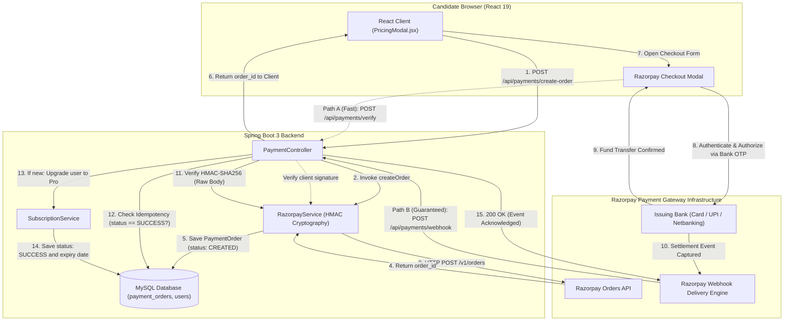

# Payment Gateway & Webhook Architecture Guide: CrackIt

This comprehensive guide documents the end-to-end architecture, cryptography, reliability patterns, and interview questions for the **Payment Gateway & Webhook System** in CrackIt.

---

## 1. Executive Summary

In a modern SaaS platform, payment processing must decouple the **synchronous user interface** from the **asynchronous bank settlement state machine**. 

A common production mistake is relying exclusively on client-side redirects for order fulfillment. If a candidate pays ₹499 and their phone battery dies, Wi-Fi disconnects, or they close the browser tab before the redirect callback fires, client-only verification causes silent business failure: **the customer's bank account is debited, but their subscription is never activated**.

To solve this, CrackIt implements a dual-path fulfillment model:
1. **Synchronous Fast Path**: Instant feedback for the browser user interface via client signature verification (`POST /api/payments/verify`).
2. **Asynchronous Guaranteed Path**: Server-to-server delivery via **Razorpay Webhooks** (`POST /api/payments/webhook`) secured with **HMAC-SHA256** and protected by **Idempotent processing**.

---

## 2. End-to-End System Architecture Diagram



---

## 3. The Core Problem: Client-Side Redirect vs. Webhook

| Failure Scenario | Client-Side Redirect Only (`/verify`) | Webhook Server-to-Server (`/webhook`) |
| :--- | :--- | :--- |
| **User closes browser tab after entering OTP** | ❌ **Permanent failure**: Order stays in `CREATED`. User is billed, but not upgraded. | ✅ **Guaranteed delivery**: Razorpay server calls backend directly. User upgraded in 1s. |
| **Wi-Fi / 4G disconnects mid-payment** | ❌ Request dropped; user must contact customer support. | ✅ Razorpay retries webhook with exponential backoff until delivered. |
| **Malicious client tampers with response payload** | ⚠️ Risky if signature isn't strictly verified on the server. | ✅ Payload is cryptographically signed by Razorpay private secret. |
| **App crash or mobile OS kills browser** | ❌ User lost in limbo. | ✅ Backend processes order completely independent of client device state. |

---

## 4. Cryptographic Security & Webhook Verification

### 4.1 HMAC-SHA256 Signature Scheme
Every webhook sent by Razorpay includes an HTTP header:
```http
X-Razorpay-Signature: 41129dc7a30bd3d64db68118fd1342bb142185374ae65d55f90b8424ec7b0cf6
```

This signature is a Hash-based Message Authentication Code (**HMAC**) calculated using **SHA-256**:

$$\text{Signature} = \text{HexEncode}\Big(\text{HMAC-SHA256}\big(\text{Raw Payload Bytes}, \;\text{Webhook Secret}\big)\Big)$$

### 4.2 The Spring Boot "Raw Body" Trap
A subtle bug in Spring Boot webhook handling occurs when binding `@RequestBody` to a Java DTO:
```java
// BUGGY IMPLEMENTATION - NEVER DO THIS FOR WEBHOOKS:
@PostMapping("/webhook")
public ResponseEntity<?> handleWebhook(@RequestBody WebhookPayload payload, 
                                       @RequestHeader("X-Razorpay-Signature") String sig) {
    String jsonString = objectMapper.writeValueAsString(payload);
    // FAILS! ObjectMapper re-serializes with different whitespace/ordering.
    boolean valid = verifyHmac(jsonString, sig); 
}
```
**Why it fails**: Jackson normalizes JSON (strips spaces, reorders object keys). Because HMAC operates at the **byte level**, even a single space or newline difference changes the resulting SHA-256 hash completely.

**Our Fix in [`PaymentController.java`](file:///home/stpl/Crackit/crackit/src/main/java/com/crackit/payment/controller/PaymentController.java)**:
```java
@PostMapping("/webhook")
public ResponseEntity<Map<String, Object>> handleRazorpayWebhook(
        @RequestBody String rawBody, // Exact unparsed UTF-8 bytes!
        @RequestHeader(value = "X-Razorpay-Signature", required = false) String signature
)
```

### 4.3 Preventing Timing Attacks (`MessageDigest.isEqual`)
When comparing cryptographic hashes in Java:
```java
// VULNERABLE: Standard String.equals()
computedSignature.equals(incomingSignature);
```
Standard `String.equals()` terminates execution upon reaching the first non-matching byte. An attacker can transmit varying signatures and measure sub-nanosecond latency differences to reconstruct the valid signature byte by byte (**Timing Side-Channel Attack**).

**Our Fix in [`RazorpayService.java`](file:///home/stpl/Crackit/crackit/src/main/java/com/crackit/payment/service/RazorpayService.java)**:
```java
boolean matches = MessageDigest.isEqual(
        generatedSignature.getBytes(StandardCharsets.UTF_8),
        signature.getBytes(StandardCharsets.UTF_8)
);
```
`MessageDigest.isEqual()` performs a **constant-time comparison** ($\mathcal{O}(N)$ invariant of where mismatches occur), completely neutralizing timing attacks.

---

## 5. Distributed Systems Reliability Patterns

### 5.1 Idempotency Guard (At-Least-Once Delivery)
Payment gateways guarantee **at-least-once delivery**. If your server takes more than 5 seconds to reply with `200 OK` (due to database contention, GC pauses, or network latency), the gateway assumes packet drop and **retries the same webhook up to 24 hours later**.

Furthermore, both the user's browser (`/verify`) and the gateway's server (`/webhook`) may hit your system concurrently.

**Idempotent State Guard**:
```java
PaymentOrder paymentOrder = paymentOrderRepository.findByOrderId(orderId).orElse(null);

if ("order.paid".equals(event) || "payment.captured".equals(event)) {
    // If already processed by /verify or a previous webhook attempt:
    if (paymentOrder.getStatus() == PaymentStatus.SUCCESS) {
        log.info("Order {} already SUCCESS. Idempotent bypass triggered.", orderId);
        return ResponseEntity.ok(Map.of("status", "success", "message", "Order already processed"));
    }

    // First arrival: execute transition and credit user
    paymentOrder.setStatus(PaymentStatus.SUCCESS);
    paymentOrderRepository.save(paymentOrder);
    subscriptionService.upgradeUser(paymentOrder.getUser(), paymentOrder.getPlan());
}
```

### 5.2 HTTP Status Code Semantics for Webhooks
- **Return `200 OK`**: Tells Razorpay *"We received and stored this event successfully. Stop retrying."*
- **Return `400 Bad Request`**: Returned when the signature is invalid or forged. Tells Razorpay the payload was rejected.
- **Return `500 Internal Server Error`**: Returned **only** for transient infrastructure failures (e.g. database down). Razorpay will retry using an exponential backoff schedule.

### 5.3 Spring Security Whitelisting
In [`SecurityConfig.java`](file:///home/stpl/Crackit/crackit/src/main/java/com/crackit/auth/config/SecurityConfig.java):
```java
.authorizeHttpRequests(auth -> auth
        .requestMatchers("/api/auth/**").permitAll()
        .requestMatchers("/api/payments/webhook").permitAll() // Must permit public webhook ingress!
        .requestMatchers("/api/admin/**").hasRole("ADMIN")
        .anyRequest().authenticated()
)
```
Because Razorpay does not possess an application JWT token, `/api/payments/webhook` must bypass standard Bearer authentication. Authorization is instead enforced at the application boundary via cryptographic **HMAC signature verification**.

---

## 6. Top 10 Senior & Staff SWE Interview Questions & Answers

### Q1: Why do we need webhooks if the client already calls `/api/payments/verify`?
> **Answer**: Client-side redirects are fundamentally unreliable. The user's device can lose power, switch networks, or crash immediately after bank authorization. If we rely solely on the browser redirect, users will be charged without receiving their purchases. Webhooks provide an asynchronous, guaranteed server-to-server channel independent of the client's device state.

---

### Q2: How do you handle duplicate webhook deliveries?
> **Answer**: We enforce strict **idempotency**. Every webhook payload contains the unique `order_id`. Before making any business state changes, we query the database for that `order_id`. If `order.status == SUCCESS`, we skip subscription provisioning and immediately respond with `200 OK`. This guarantees that even if a gateway delivers the event 10 times, the user is only upgraded once.

---

### Q3: What is a Timing Attack in signature verification, and how do you protect against it?
> **Answer**: Standard string equality (`a.equals(b)`) short-circuits on the first mismatched character, creating subtle differences in response times. By measuring these timing variances over millions of requests, an attacker can brute-force the signature character by character. We prevent this by using `java.security.MessageDigest.isEqual()`, which compares byte arrays in constant time regardless of where or whether mismatches occur.

---

### Q4: Why does parsing the request body as a POJO (`@RequestBody WebhookDto`) break signature verification?
> **Answer**: HMAC-SHA256 is sensitive to the exact raw byte sequence. When a framework deserializes JSON into an object and re-serializes it back to a string, whitespace, indentation, key ordering, and floating-point representations change. This produces a completely different hash. We must always capture the raw incoming `byte[]` or `String` body directly from the HTTP request stream before any deserialization occurs.

---

### Q5: What should your webhook endpoint return if a duplicate event is received? (200 vs 409 vs 500)
> **Answer**: It must return **`200 OK`**. Gateways interpret any non-2xx status code (including `409 Conflict` or `500 Internal Error`) as a delivery failure and will continue retrying with exponential backoff. Returning `200 OK` acknowledges successful receipt and signals the gateway to cease retrying.

---

### Q6: What happens if the Webhook arrives BEFORE the client redirect `/verify` finishes?
> **Answer**: This is a classic race condition in high-speed networks. In CrackIt, both `/verify` and `/webhook` share the same idempotent state check:
> 1. Whichever request reaches the database first transitions the order from `CREATED` to `SUCCESS` and grants the subscription.
> 2. The second request checks `order.getStatus() == SUCCESS`, detects that fulfillment has already executed, and safely exits without duplicating changes.

---

### Q7: How would you handle payment reconciliation if your service suffered 6 hours of downtime?
> **Answer**: 
> 1. **Gateway Retries**: Razorpay continues retrying webhooks for up to 24 hours. When the backend recovers, queued webhooks are processed automatically.
> 2. **Reconciliation Cron Job**: In enterprise production, we run a scheduled Spring Batch / Quartz job (e.g. every hour) that queries all orders in `CREATED` status older than 30 minutes, calls Razorpay's `GET /v1/orders/{orderId}/payments` API, and syncs any missing transactions that slipped through the downtime window.

---

### Q8: What is the difference between Payment Authorization and Payment Capture?
> **Answer**: 
> - **Authorization**: The issuing bank reserves the customer's funds and verifies card legitimacy, but money has not moved yet.
> - **Capture**: The merchant confirms the transaction and requests the actual settlement of funds. Razorpay auto-captures standard e-commerce payments, emitting the `payment.captured` event to trigger fulfillment.

---

### Q9: Why is CSRF disabled for the Webhook endpoint, and does that introduce vulnerability?
> **Answer**: Cross-Site Request Forgery (CSRF) tokens protect state-changing browser sessions using ambient credentials (cookies). Webhooks are stateless, server-to-server calls originating from an external entity that cannot obtain CSRF tokens. Disabling CSRF on `/api/payments/webhook` does not introduce risk because authenticity is strictly verified by cryptographic HMAC signature verification rather than cookies.

---

### Q10: How do you handle distributed concurrency if multiple webhook events arrive simultaneously for the same order?
> **Answer**: If multiple instances of Spring Boot process duplicate webhooks concurrently:
> 1. **Database-Level Unique Constraints**: `payment_orders.order_id` is unique.
> 2. **Pessimistic Locking**: `SELECT * FROM payment_orders WHERE order_id = :id FOR UPDATE` locks the database row for the duration of the transaction.
> 3. **Redis Distributed Lock (Redlock)**: A Redis lock `SET lock:order:{id} true NX EX 10` ensures that only one worker thread across a distributed cluster executes the fulfillment block at any given millisecond.

---

## 7. Verification & Automated Test Suite

The webhook verification pipeline is tested in [`RazorpayWebhookTest.java`](file:///home/stpl/Crackit/crackit/src/test/java/com/crackit/payment/RazorpayWebhookTest.java):

```bash
mvn test -Dtest=RazorpayWebhookTest
```

### Verified Test Scenarios:
1. `testValidWebhookSignature`: Confirms valid HMAC-SHA256 digests pass verification.
2. `testTamperedWebhookSignature`: Confirms tampered or forged signatures are rejected.
3. `testMissingWebhookSignature`: Rejects requests lacking the `X-Razorpay-Signature` header.
4. `testSuccessfulOrderPaidProcessing`: Verifies `order.paid` transitions status to `SUCCESS` and invokes `subscriptionService.upgradeUser()`.
5. `testIdempotentDuplicateWebhook`: Verifies duplicate deliveries acknowledge `200 OK` without double-upgrading or issuing duplicate SQL writes.
6. `testControllerRejectsBadSignature`: Confirms `400 Bad Request` is returned on signature failure with 0 database modifications.
