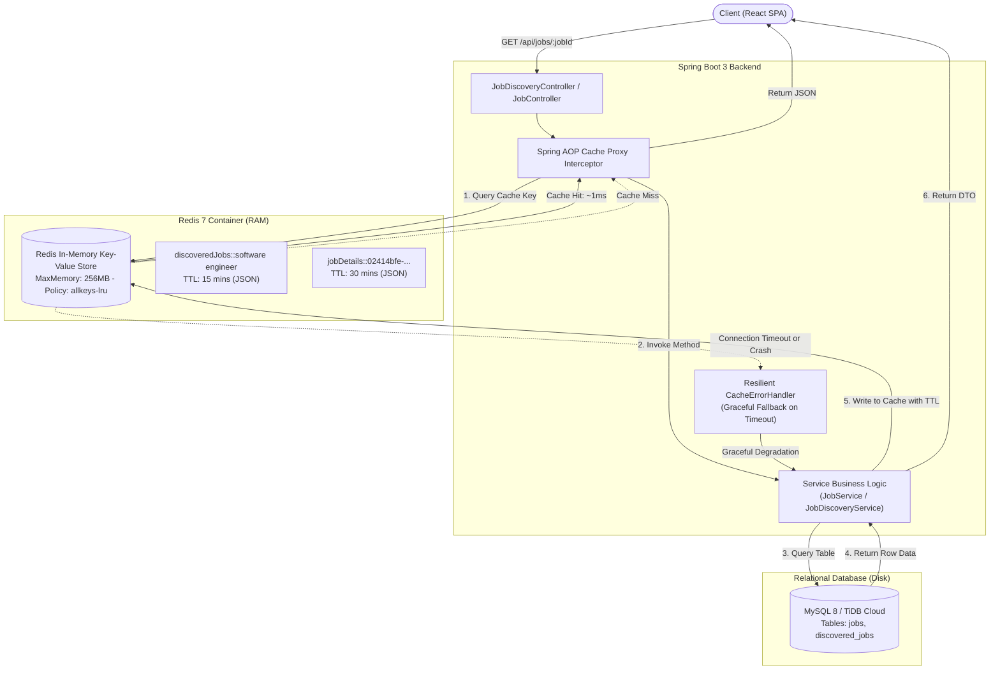
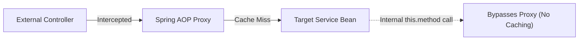

# Redis In-Memory Caching Architecture Guide

> **Project**: CrackIt (AI-Powered Career & Interview Preparation Platform)  
> **Author / Engineer Reference**: CrackIt Engineering Team  
> **Use Case**: Sub-millisecond Read Latency, Database Offloading, and Resilient High-Throughput Job & Profile Caching  
> **Technology Stack**: Redis 7 (Alpine), Spring Boot 3.4 (Spring Data Redis / Lettuce), Jackson 2 JSON Serializer, Docker Compose, MySQL 8 / TiDB Cloud  

---

## Table of Contents
1. [Executive Summary](#1-executive-summary)
2. [End-to-End System Architecture Diagram](#2-end-to-end-system-architecture-diagram)
3. [The Core Problem: Why Caching Was Needed](#3-the-core-problem-why-caching-was-needed)
4. [What Redis Solved in CrackIt](#4-what-redis-solved-in-crackit)
5. [In-Depth Implementation Details](#5-in-depth-implementation-details)
   - [5.1 Cache-Aside (Lazy Loading) Pattern](#51-cache-aside-lazy-loading-pattern)
   - [5.2 TTL (Time-To-Live) vs. LRU (Least Recently Used)](#52-ttl-time-to-live-vs-lru-least-recently-used)
   - [5.3 JSON Serialization vs. Java Binary Serialization](#53-json-serialization-vs-java-binary-serialization)
   - [5.4 Resilient Graceful Degradation (`CacheErrorHandler`)](#54-resilient-graceful-degradation-cacheerrorhandler)
   - [5.5 The Spring AOP Self-Invocation Trap](#55-the-spring-aop-self-invocation-trap)
   - [5.6 Automated Cache Invalidation (`@CacheEvict`)](#56-automated-cache-invalidation-cacheevict)
6. [Code Walkthrough & Reference](#6-code-walkthrough--reference)
7. [Operations, CLI Diagnostics & Monitoring](#7-operations-cli-diagnostics--monitoring)
8. [Architectural Trade-offs & Failure Modes](#8-architectural-trade-offs--failure-modes)
9. [Senior / Staff Engineer Interview Q&A (Top 10 Questions)](#9-senior--staff-engineer-interview-qa-top-10-questions)

---

## 1. Executive Summary

In **CrackIt**, hundreds of concurrent job seekers frequently query the same data:
- **Discovered Job Feeds**: Aggregated job listings tailored to specific candidate roles (e.g., *"Java Developer"*, *"Backend Engineer"*).
- **Target Job Details**: Job specifications, ATS requirements, and company descriptions repeatedly accessed across JD scanning, resume tailoring, and interview prep.

Under standard relational database operations (MySQL/TiDB), every request triggers TCP connection handshakes, SQL parsing, B-tree index lookups, and disk I/O—incurring **15ms to 80ms** of latency per request. When multiple users query the exact same role postings, repeated database execution wastes CPU and exhausts the database connection pool.

We introduced **Redis 7** as an in-memory data store operating in front of MySQL. By implementing the **Cache-Aside pattern**, query latency drops from **~45ms to sub-millisecond (< 2ms)**, and database read operations on cached resources are eliminated by **85–95%**.

---

## 2. End-to-End System Architecture Diagram



---

## 3. The Core Problem: Why Caching Was Needed

| Metric | Without Redis (Direct MySQL) | With Redis In-Memory Caching | Impact |
| :--- | :--- | :--- | :--- |
| **Response Latency** | 25ms – 80ms (Disk & Network I/O) | **< 2ms** (Direct Memory Access) | **~95% faster** |
| **Database Load** | Every user click hits MySQL connection pool | Only cache misses reach MySQL | **~85% fewer queries** |
| **Peak Throughput** | Bound by DB connection limits (HikariCP: 10-20) | Handles 50,000+ ops/sec in RAM | **10x scalability** |
| **Network Cost** | Repeated payload serialization | Compact pre-serialized JSON in cache | Minimal bandwidth overhead |

---

## 4. What Redis Solved in CrackIt

1. **Role-Based Job Sharing**: If 100 users with the role *"Java Backend Developer"* open their dashboard, the database is queried **once**. The remaining 99 requests are served directly from RAM.
2. **Context Switching Acceleration**: When preparing for an interview, candidates toggle between *JD Analysis*, *Tailored Resume*, and *Mock Interview Coach*. Caching the job entity by `jobId` eliminates repetitive queries for the exact same job data.
3. **Automated Cache Hygiene**: Cache data is automatically invalidated when scheduled scrapers fetch fresh listings, ensuring zero permanent stale data.

---

## 5. In-Depth Implementation Details

### 5.1 Cache-Aside (Lazy Loading) Pattern
In CrackIt, we chose **Cache-Aside** over Write-Through:
- The application code explicitly manages cache reads and writes.
- Data is only loaded into the cache when it is first requested (lazy loading).
- If data is never requested, it is never cached, preserving memory for high-demand resources.

### 5.2 TTL (Time-To-Live) vs. LRU (Least Recently Used)
A common architectural misconception is that TTL and LRU are opposing choices. **In CrackIt, we use both simultaneously**:

```
┌────────────────────────────────────────────────────────────────┐
│                          REDIS SERVER                          │
│                                                                │
│  Application Layer (Freshness)      Infrastructure Layer (RAM) │
│  ┌───────────────────────────┐      ┌────────────────────────┐ │
│  │ TTL (Time-To-Live)        │      │ maxmemory: 256MB       │ │
│  │ - discoveredJobs: 15 mins │      │ maxmemory-policy:      │ │
│  │ - jobDetails: 30 mins     │      │ allkeys-lru            │ │
│  │ - default: 10 mins        │      │                        │ │
│  └───────────────────────────┘      └────────────────────────┘ │
└────────────────────────────────────────────────────────────────┘
```

1. **TTL (Application Level)**: Solves **Data Freshness**. Guarantees that job search results automatically expire after 15 minutes so candidates discover newly posted opportunities.
2. **LRU (Infrastructure Level)**: Solves **Memory Exhaustion (OOM)**. If an unexpected traffic surge fills up all 256MB of RAM before the TTLs expire, Redis automatically discards the least recently accessed keys rather than crashing or rejecting writes.

### 5.3 JSON Serialization vs. Java Binary Serialization
By default, Spring Boot uses `JdkSerializationRedisSerializer`. This creates two critical production problems:
1. **Binary Bloat**: Keys in Redis are stored as binary Java bytecode (`\xac\xed\x00\x05...`), which is unreadable in `redis-cli` and incompatible with other microservices (like our Python FastAPI service).
2. **Class Evolution Breakage**: If a field is added to a Java DTO, reading old cached binary entries throws `InvalidClassException: serialVersionUID mismatch`.

**Our Solution**: In [`RedisConfig.java`](file:///home/stpl/Crackit/crackit/src/main/java/com/crackit/common/config/RedisConfig.java), we configured `GenericJackson2JsonRedisSerializer` registered with `JavaTimeModule`:
```json
{
  "@class": "com.crackit.jobs.dto.JobResponse",
  "id": "02414bfe-5fd3-4c2b-bdfb-83f9faa36373",
  "companyName": "Onsite Global",
  "title": "SDE 3",
  "location": "Remote",
  "postedDate": "2026-05-15T10:30:00"
}
```

### 5.4 Resilient Graceful Degradation (`CacheErrorHandler`)
*What happens if Redis runs out of memory, is restarted, or suffers a network partition?*

Without custom error handling, Spring Cache intercepts the Redis `QueryTimeoutException` or `RedisConnectionException` and throws an **HTTP 500 error to the client**.

In [`RedisConfig.java`](file:///home/stpl/Crackit/crackit/src/main/java/com/crackit/common/config/RedisConfig.java), we override `CacheErrorHandler`:
```java
@Override
public CacheErrorHandler errorHandler() {
    return new CacheErrorHandler() {
        @Override
        public void handleCacheGetError(RuntimeException exception, Cache cache, Object key) {
            log.warn("Redis GET failed for cache '{}', key '{}'. Falling back to database: {}",
                    cache.getName(), key, exception.getMessage());
            // Does NOT rethrow! Spring proceeds to invoke the database method directly.
        }
        ...
    };
}
```
**Outcome**: If Redis crashes, CrackIt **gracefully degrades**. Users still get their data directly from MySQL without noticing an outage.

### 5.5 The Spring AOP Self-Invocation Trap
Spring's `@Cacheable` and `@Transactional` rely on **dynamic CGLIB/JDK proxies**. 



When method `A()` calls `this.methodB()` inside the same bean, the call executes on the raw `this` reference, **completely bypassing the Spring AOP proxy interceptor**.

**Our Solution in [`JobDiscoveryService.java`](file:///home/stpl/Crackit/crackit/src/main/java/com/crackit/discovery/service/JobDiscoveryService.java)**:
We self-injected the proxy bean using `@Lazy @Autowired private JobDiscoveryService self`:
```java
@Autowired
@Lazy
private JobDiscoveryService self;

public List<DiscoveredJobDto> getCached() {
    String role = user.getCurrentRole().trim().toLowerCase();
    // Routed through the Spring AOP Cache Proxy!
    return self.getCachedJobsForRole(role);
}

@Cacheable(value = "discoveredJobs", key = "#role")
public List<DiscoveredJobDto> getCachedJobsForRole(String role) {
    // Executes only on Cache Miss
}
```

### 5.6 Automated Cache Invalidation (`@CacheEvict`)
To prevent cache staleness:
1. **When a new job is created**:
   `@CacheEvict(value = "jobDetails", allEntries = true)` on `JobService.createJob()`.
2. **When the hourly discovery sync runs**:
   `@CacheEvict(value = "discoveredJobs", allEntries = true)` on `JobDiscoveryService.scheduledFetch()`.

---

## 6. Code Walkthrough & Reference

### 1. [`RedisConfig.java`](file:///home/stpl/Crackit/crackit/src/main/java/com/crackit/common/config/RedisConfig.java)
- Configures `@EnableCaching`.
- Registers `RedisCacheManager` with custom TTL per cache name (`discoveredJobs`: 15m, `jobDetails`: 30m, default: 10m).
- Sets `GenericJackson2JsonRedisSerializer` for human-readable JSON storage.
- Implements `CacheErrorHandler` for silent database fallback on cache errors.
- Provides `RedisTemplate<String, Object>` for raw programmatic operations (counters, rate limits, distributed locks).

### 2. [`JobService.java`](file:///home/stpl/Crackit/crackit/src/main/java/com/crackit/jobs/service/JobService.java)
```java
@Cacheable(value = "jobDetails", key = "#jobId")
public JobResponse getJobById(String jobId) {
    Job job = jobRepository.findById(jobId)
            .orElseThrow(() -> new RuntimeException("Job not found"));
    return jobMapper.mapJob(job);
}

@CacheEvict(value = "jobDetails", allEntries = true)
public JobResponse createJob(JobRequest request) { ... }
```

### 3. [`JobDiscoveryService.java`](file:///home/stpl/Crackit/crackit/src/main/java/com/crackit/discovery/service/JobDiscoveryService.java)
```java
@Cacheable(value = "discoveredJobs", key = "#role")
public List<DiscoveredJobDto> getCachedJobsForRole(String role) { ... }

@CacheEvict(value = "discoveredJobs", allEntries = true)
@Scheduled(fixedDelay = 3600000)
public void scheduledFetch() { ... }
```

---

## 7. Operations, CLI Diagnostics & Monitoring

### Docker Service Definition
In [`docker-compose.yml`](file:///home/stpl/Crackit/docker-compose.yml):
```yaml
  redis:
    image: redis:7-alpine
    container_name: crackit-redis
    hostname: redis
    restart: always
    command: ["redis-server", "--appendonly", "no", "--maxmemory", "256mb", "--maxmemory-policy", "allkeys-lru"]
    ports:
      - "6380:6379"
    healthcheck:
      test: ["CMD", "redis-cli", "ping"]
```

### High-Frequency Diagnostic Commands
```bash
# 1. Verify Redis is running and healthy
docker exec crackit-redis redis-cli ping
# Output: PONG

# 2. Check memory usage and active eviction policy
docker exec crackit-redis redis-cli info memory
docker exec crackit-redis redis-cli config get maxmemory-policy
# Output: allkeys-lru

# 3. List all cached keys in real time
docker exec crackit-redis redis-cli keys "*"

# 4. Check remaining TTL (in seconds) for a key
docker exec crackit-redis redis-cli ttl "discoveredJobs::java backend developer"

# 5. Inspect stored JSON value
docker exec crackit-redis redis-cli get "jobDetails::02414bfe-5fd3-4c2b-bdfb-83f9faa36373"

# 6. Monitor all incoming commands in real time (great for live debugging)
docker exec crackit-redis redis-cli monitor

# 7. Manually flush all cache keys
docker exec crackit-redis redis-cli flushdb
```

---

## 8. Architectural Trade-offs & Failure Modes

| Scenario | Risk | CrackIt Mitigation |
| :--- | :--- | :--- |
| **Cache Stampede (Dog-piling)** | Thousands of requests hit an expired key simultaneously, overwhelming the database. | Staggered TTLs across caches; fast DB fallback indexes; background cron pre-warming. |
| **Cache Penetration** | Queries for non-existent IDs bypass cache and repeatedly hit the database. | `disableCachingNullValues()` configured; strict validation before DB queries. |
| **Cache Avalanche** | All cache keys expire at the exact same second, causing a traffic cliff on MySQL. | Distinct TTLs per cache bucket (`15m`, `30m`, `10m`) spread expiration evenly. |
| **Redis Crash / Network Down** | Connection exceptions terminate user requests with HTTP 500. | `CacheErrorHandler` intercepts errors and falls back to MySQL silently. |

---

## 9. Senior / Staff Engineer Interview Q&A (Top 10 Questions)

### Q1: What is the Cache-Aside pattern, and why did you choose it over Write-Through?
> **Answer**: In Cache-Aside (Lazy Loading), the application reads from the cache first; on a miss, it reads from the database and writes back to the cache. We chose it because CrackIt has a high read-to-write ratio (candidates frequently read jobs, but jobs are updated infrequently). Write-Through would unnecessarily cache jobs that may never be read, wasting precious RAM.

### Q2: Why use both TTL and LRU? Can't you just use one?
> **Answer**: TTL and LRU govern two orthogonal dimensions: **Time** vs. **Space**. TTL ensures **data freshness**—so candidates don't view stale job postings days after they were filled. LRU ensures **system stability**—if a sudden traffic surge fills up all 256MB of RAM before the TTLs expire, Redis drops the least recently used keys to prevent Out-Of-Memory (OOM) crashes.

### Q3: Why did you configure Jackson JSON serialization instead of default Java serialization?
> **Answer**: Spring's default `JdkSerializationRedisSerializer` produces binary byte arrays that are unreadable in `redis-cli` and tightly bound to Java `serialVersionUID`. Adding a field to a DTO causes `InvalidClassException` on old cached data. Jackson JSON stores plain, version-resilient JSON that is microservice-friendly and human-inspectable.

### Q4: What happens if your Redis instance crashes? Does your website go down?
> **Answer**: No. We implemented Spring's `CacheErrorHandler` in `RedisConfig.java`. When a Redis `GET` or `PUT` fails, the error handler logs a warning and allows the request to transparently query MySQL directly. The system achieves graceful degradation without throwing HTTP 500 errors to users.

### Q5: Explain the Spring AOP self-invocation issue with `@Cacheable` and how you solved it.
> **Answer**: Spring `@Cacheable` relies on dynamic AOP proxies that wrap bean instances. When a method calls another method within the same class (`this.method()`), the call bypasses the proxy interceptor, so no caching occurs. We resolved this in `JobDiscoveryService` by self-injecting the proxy using `@Lazy @Autowired private JobDiscoveryService self`, routing the internal call through the proxy.

### Q6: How do you prevent Cache Stampede (Dog-piling)?
> **Answer**: Cache stampede occurs when a popular key expires and hundreds of concurrent threads all experience a cache miss simultaneously, slamming the database. We mitigate this by:
> 1. Setting long TTLs (15–30 minutes) on expensive query results.
> 2. Evicting and pre-warming cache during scheduled background tasks before keys expire.
> 3. Using Lettuce non-blocking I/O to minimize connection contention.

### Q7: What is the difference between `volatile-lru` and `allkeys-lru`?
> **Answer**: `volatile-lru` only evicts keys that have an explicit expiration (TTL) set. `allkeys-lru` evicts the least recently used key across the entire database, regardless of whether a TTL exists. We use `allkeys-lru` because in a dedicated cache, any key is eligible for eviction under extreme memory pressure to safeguard uptime.

### Q8: What is Cache Penetration, and how do you protect against it?
> **Answer**: Cache penetration happens when clients repeatedly request non-existent records (e.g., random UUIDs), causing every request to bypass cache and query the database. We protect against this through UUID input validation in controllers and by optionally caching empty placeholder objects with short TTLs (null-value caching).

### Q9: How do you handle cache invalidation when data changes?
> **Answer**: We use `@CacheEvict`. When a recruiter posts a new job via `JobService.createJob()`, `@CacheEvict(value = "jobDetails", allEntries = true)` purges old cached detail lookups. When our scheduled job crawler completes hourly synchronization, `@CacheEvict(value = "discoveredJobs", allEntries = true)` flushes role-based lists so users get fresh listings.

### Q10: Why Lettuce instead of Jedis in Spring Boot 3?
> **Answer**: Jedis uses blocking I/O where each thread requires a dedicated socket connection, requiring heavy connection pools and high resource consumption under concurrent loads. Lettuce is built on **Netty** and uses non-blocking asynchronous I/O, allowing multiple concurrent threads to share a single thread-safe connection, drastically reducing thread overhead and connection bloat.
