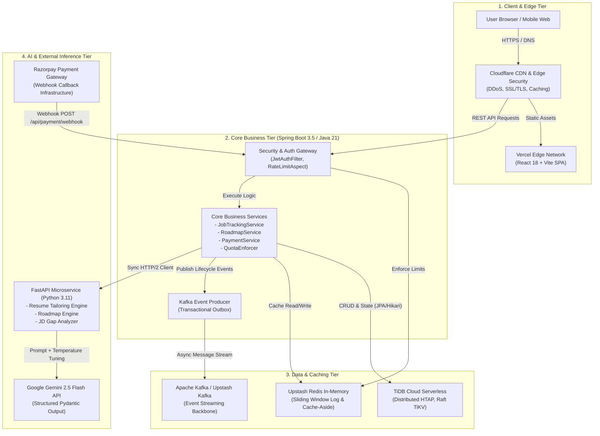
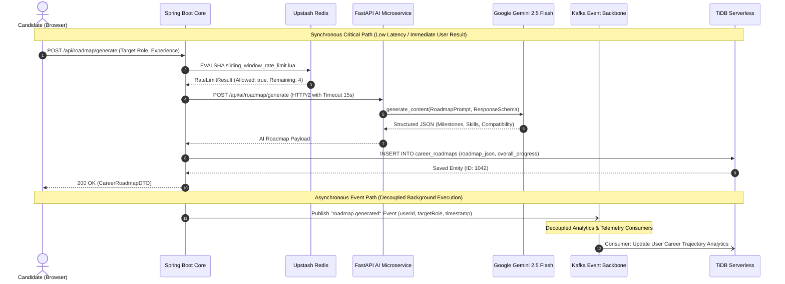
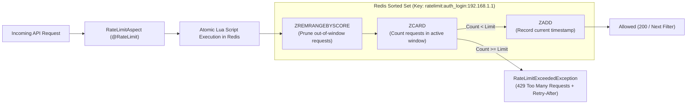
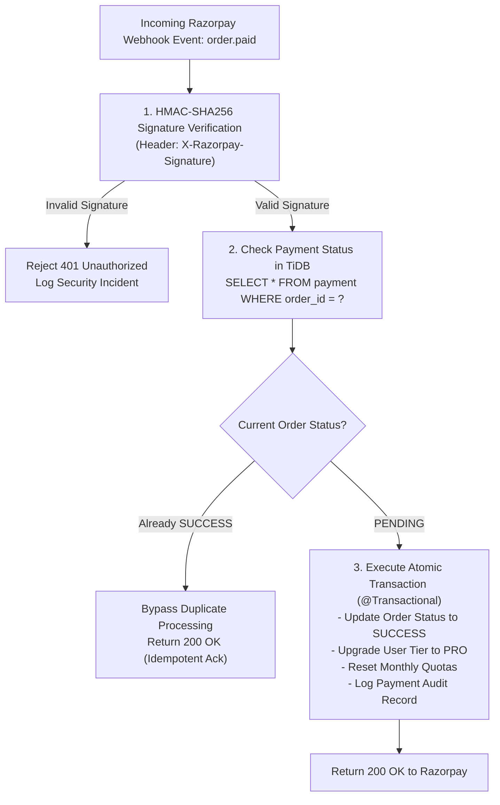
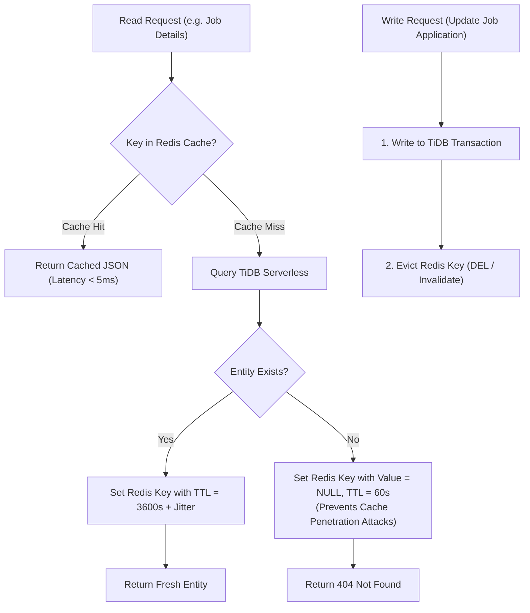
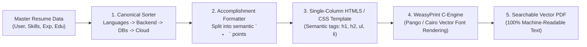
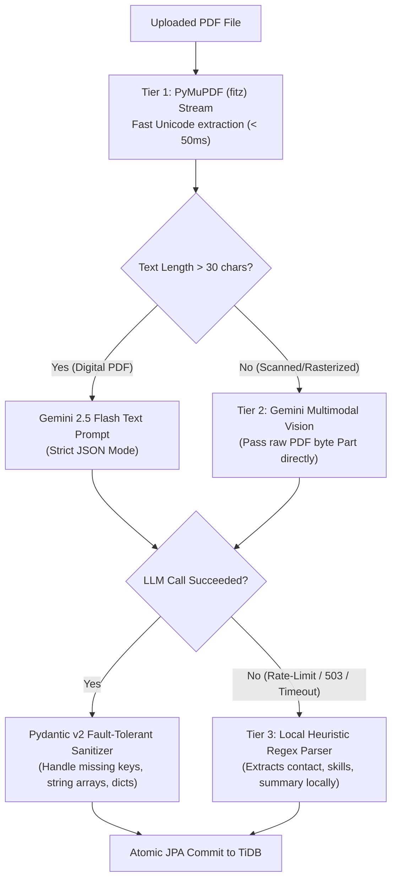
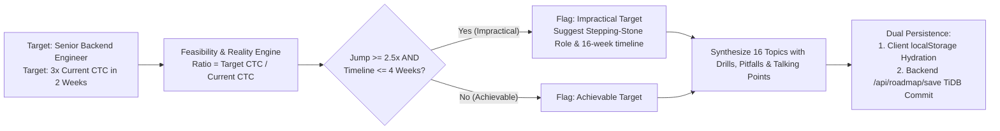
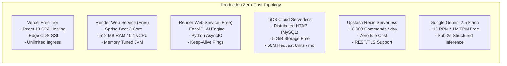

# 🏛️ CrackIt — Master End-to-End System Design Blueprint

> **Target Audience**: Staff / Principal Software Engineers, System Architects, Technical Interview Candidates.  
> **System Scope**: Distributed AI-Powered Job Application & Career Acceleration Platform.  
> **Production Operating Budget**: \$0 / month (100% Free-Tier Serverless Infrastructure).

---

## 1. Executive Summary & Architectural Vision

**CrackIt** is a production-grade, distributed career acceleration platform designed to automate and optimize the end-to-end tech interview and job application lifecycle. It provides:
1. **Targeted Job Discovery & Pipeline Tracking**: Real-time aggregated search (Adzuna, JSearch), Kanban board application lifecycle management, and interview scheduling.
2. **AI-Driven Resume Tailoring & JD Gap Analysis**: Anti-anchored, multi-metric candidate-to-job matching, generating Google X-Y-Z structured resume achievements with hallucination suppression.
3. **Adaptive Career Prep Roadmaps & Target Company Compatibility**: Dynamic milestone generation, target company culture/skill compatibility matrices, and interactive progress tracking.
4. **Resilient Monetization & Quota Gating**: Subscription-based quota enforcement, distributed rate limiting, and idempotent payment processing with Razorpay webhooks.

### Core Architectural Non-Negotiables
* **Strict Decoupling**: Business orchestration (Spring Boot 3, Java 21) is strictly decoupled from heavy AI inference (FastAPI, Python 3.11).
* **Zero Single Point of Failure (SPOF)**: Fail-open caching, circuit breaking with rule-based heuristic fallbacks, and multi-region distributed databases.
* **Distributed Consistency & Idempotency**: Exactly-once webhook settlement and millisecond-accurate sliding-window rate limiting.
* **Zero-Cost Sustainability**: Architected to operate within free-tier quotas of Vercel, Render, TiDB Cloud Serverless, Upstash Redis, and Google Gemini API without service degradation.

---

## 2. Global Topography & Infrastructure Topology



### Component Responsibility Breakdown

| Tier | Component | Technology | Primary Responsibility |
| :--- | :--- | :--- | :--- |
| **Client** | Web Application | React 18, Vite, Tailwind CSS, Lucide Icons | Client-side routing, optimistic UI updates, auth token management, real-time dashboard telemetry. |
| **Edge** | Edge CDN & DNS | Cloudflare | Anycast DNS routing, TLS termination, edge asset caching, DDoS mitigation, and HTTP request sanitization. |
| **Core** | API Server | Spring Boot 3.5.14, Java 21 | JWT authentication, role-based access control, quota enforcement, distributed rate limiting, business logic. |
| **AI Microservice** | AI Inference Service | FastAPI, Python 3.11, Pydantic v2 | LLM orchestration, structured prompt compilation, anti-anchoring metric diversity, PDF text parsing. |
| **Database** | Relational / HTAP | TiDB Serverless (MySQL 8.0 Compatible) | ACID transactional store for users, job applications, roadmaps, payment records; distributed Raft consensus. |
| **Cache** | In-Memory Store | Upstash Redis (RESP3) | Sliding window log rate limiting via Lua, Cache-Aside for application lookups, token blacklisting. |
| **Events** | Message Broker | Apache Kafka / Upstash Kafka | Asynchronous event backbone for analytics, audit logging, notification dispatch, and heavy background jobs. |
| **External** | Generative AI | Google Gemini 2.5 Flash | Structured multi-tier JSON generation for resumes, job descriptions, and interview roadmaps. |
| **External** | Payment Provider | Razorpay | Checkout sessions, automated subscription billing, and signed webhook callback notifications. |

---

## 3. Deep Synchronous vs. Asynchronous Communication Matrix

A cornerstone of Staff-level system design is knowing **when to block** and **when to decouple**. CrackIt balances low-latency user feedback with resilient background event processing.



### Protocol & Flow Decision Matrix

| Path / Interaction | Protocol | Mode | Latency Target | Resilience / Fallback Strategy | Primary Code Reference |
| :--- | :--- | :--- | :--- | :--- | :--- |
| **Client ➔ Spring Boot** | HTTPS / REST / JSON | Sync | `< 250ms` | Cloudflare retry, Client-side exponential backoff | [`SecurityConfig.java`](file:///home/stpl/Crackit/crackit/src/main/java/com/crackit/auth/config/SecurityConfig.java) |
| **Spring Boot ➔ Redis** | TCP / RESP | Sync | `< 5ms` | Fail-open circuit breaker (allow request if Redis fails) | [`RateLimiterService.java`](file:///home/stpl/Crackit/crackit/src/main/java/com/crackit/common/ratelimit/service/RateLimiterService.java) |
| **Spring Boot ➔ TiDB** | JDBC (HikariCP) | Sync | `< 30ms` | Connection pool fail-fast, Read-only replicas | [`application.yaml`](file:///home/stpl/Crackit/crackit/src/main/resources/application.yaml) |
| **Spring Boot ➔ FastAPI** | HTTP/2 / REST | Sync | `2s - 8s` | 15s Socket Timeout, Fallback heuristic generation | [`AiServiceClient.java`](file:///home/stpl/Crackit/crackit/src/main/java/com/crackit/ai/client/AiServiceClient.java) |
| **FastAPI ➔ Gemini 2.5** | HTTPS / gRPC | Sync | `1.5s - 6s` | 3-retries with exponential backoff on 429/503 | [`roadmap_service.py`](file:///home/stpl/Crackit/crackit-ai-service/app/services/roadmap_service.py) |
| **Spring Boot ➔ Kafka** | TCP / Kafka Protocol | Async | `< 10ms` | In-memory buffer, Dead Letter Queue (DLQ) | [`KAFKA_ARCHITECTURE_GUIDE.md`](file:///home/stpl/Crackit/KAFKA_ARCHITECTURE_GUIDE.md) |
| **Razorpay ➔ Spring Boot**| HTTPS / Webhook POST | Async Callback | `< 500ms` | Idempotent DB deduplication + HMAC-SHA256 signature check | [`PaymentController.java`](file:///home/stpl/Crackit/crackit/src/main/java/com/crackit/payment/controller/PaymentController.java) |

---

## 4. Cross-Cutting Distributed Guarantees & Resilience Patterns

### 4.1 Distributed Sliding Window Log Rate Limiter
Standard Fixed-Window and Token-Bucket algorithms suffer from border-burst vulnerability or lack of sliding precision. CrackIt employs an atomic **Redis Sliding Window Log** backed by a custom Lua script:

```
Window = [CurrentTime - WindowSeconds, CurrentTime]
1. Remove expired timestamps: ZREMRANGEBYSCORE(key, "-inf", WindowStart)
2. Count valid requests in window: ZCARD(key)
3. If count < limit:
     ZADD(key, CurrentTime, MemberUUID)
     EXPIRE(key, WindowSeconds)
     Return (Allowed=1, Remaining=Limit-count-1)
4. Else:
     Return (Allowed=0, Remaining=0, OldestTimestamp)
```



* **Fail-Open Resilience**: If Redis suffers a network partition or outage, the `RateLimiterService` catches `RedisConnectionException`, logs a critical alert, and **fails open** (`RateLimitResult.allowed()`), ensuring legitimate users can still authenticate and generate roadmaps.
* Code Implementation: [`sliding_window_rate_limit.lua`](file:///home/stpl/Crackit/crackit/src/main/resources/scripts/sliding_window_rate_limit.lua) and [`RateLimitAspect.java`](file:///home/stpl/Crackit/crackit/src/main/java/com/crackit/common/ratelimit/aspect/RateLimitAspect.java).

---

### 4.2 Distributed Idempotency Engine for Financial Transactions
Network retries from payment gateways (Razorpay, Stripe) inevitably result in duplicate webhook deliveries. CrackIt guarantees strict **Exactly-Once Settlement** via a dual-layer idempotency guard:



* **Zero-Double Upgrade**: Verified by unit test suite in [`RazorpayWebhookTest.java`](file:///home/stpl/Crackit/crackit/src/test/java/com/crackit/payment/RazorpayWebhookTest.java).
* **Code Reference**: [`PaymentController.java`](file:///home/stpl/Crackit/crackit/src/main/java/com/crackit/payment/controller/PaymentController.java) & [`RazorpayService.java`](file:///home/stpl/Crackit/crackit/src/main/java/com/crackit/payment/service/RazorpayService.java).

---

### 4.3 Cache-Aside Consistency & Stampede Protection
CrackIt implements the **Cache-Aside Pattern** with dynamic TTLs and negative caching:



* **TTL Jitter**: Prevents **Cache Stampede** (Thundering Herd) where thousands of keys expire simultaneously at the top of the hour. CrackIt applies `TTL = baseTTL + uniform_random(-0.1 * baseTTL, 0.1 * baseTTL)`.
* **Negative Caching**: Non-existent entities are cached for 60 seconds with an empty marker to stop malicious actors from exhausting TiDB connection pools via random IDs.

---

### 4.4 Anti-Anchoring AI Integration Architecture
A common pitfall in generative AI architectures is **Anchor Bias**—where the LLM latches onto arbitrary numbers in the input resume (e.g., "improved latency by 15%") and copies them indiscriminately across all suggestions. CrackIt solves this via:
1. **Google X-Y-Z Formula Enforcement**: Every tailored bullet must follow:  
   $$\text{"Accomplished } [X] \text{ as measured by } [Y] \text{, by doing } [Z]"$$
2. **Metric Diversity Constraint**: Forbids reusing the same metric dimension twice within a single role.
3. **Discipline-Adaptive Rubrics**: Distinct evaluation criteria for Backend (concurrency, p99 latency), DevOps (MTTR, deployment frequency), QA (test coverage, regression escapes), and Data (pipeline throughput, data freshness).
4. Code Reference: [`AI_INTEGRATION_ARCHITECTURE_GUIDE.md`](file:///home/stpl/Crackit/AI_INTEGRATION_ARCHITECTURE_GUIDE.md) and [`resume_tailoring_prompt.py`](file:///home/stpl/Crackit/crackit-ai-service/app/prompts/resume_tailoring_prompt.py).

---

### 4.5 ATS-Compliant Document Compilation & Vector PDF Engine
A major failure point in consumer resume builders is generating non-ATS-friendly files (multi-column tables, SVG text paths, or rasterized HTML canvas images) that fail parsing in enterprise ATS platforms (Workday, Taleo, Greenhouse).

CrackIt implements an enterprise ATS compilation pipeline:


* **Single-Column Constraint**: Enforces a strictly linear text stream preventing horizontal text bleed across columns.
* **Canonical Skill Precedence**: ATS parsers prioritize hard languages first. CrackIt enforces:
  $$\text{Languages} \rightarrow \text{Backend} \rightarrow \text{Databases} \rightarrow \text{Caching} \rightarrow \text{Messaging} \rightarrow \text{Cloud/DevOps} \rightarrow \text{Tools} \rightarrow \text{Core Concepts} \rightarrow \text{Other}$$
* **Implementation Reference**: [`resume_pdf_service.py`](file:///home/stpl/Crackit/crackit-ai-service/app/services/resume_pdf_service.py).

---

### 4.6 Multi-Tier Fault-Tolerant Ingestion Pipeline
When candidates upload resumes (ranging from clean Word exports to multi-column Canva graphics and scanned photos), a single parsing strategy fails. CrackIt implements a 3-tier cascade:



* **Zero 500 Errors**: Even if Google Gemini is down or rate-limited, the local heuristic fallback parses the document, ensuring users never see a raw error page.
* **Implementation Reference**: [`resume_parse_service.py`](file:///home/stpl/Crackit/crackit-ai-service/app/services/resume_parse_service.py).

---

### 4.7 16-Step Progressive Roadmap Synthesis & Feasibility Engine
High-level generic roadmaps ("Learn Java, then System Design") lack actionable engineering depth. CrackIt generates a **16-step progressive curriculum** structured across 4 sequential phases:
1. **Phase 1: Foundations & Core Mechanics** (Steps 1–4)
2. **Phase 2: Framework Internals & Data Layer Mastery** (Steps 5–8)
3. **Phase 3: High-Scale Distributed Systems & Messaging** (Steps 9–12)
4. **Phase 4: Production Resilience & System Design** (Steps 13–16)



* **Refresh Resilience**: Client instantly hydrates from `localStorage` (`crackit:active_roadmap`) to eliminate blank screens, synchronized with backend PostgreSQL/MySQL via `@PostMapping("/api/roadmap/save")`.
* **Implementation Reference**: [`RoadmapService.java`](file:///home/stpl/Crackit/crackit/src/main/java/com/crackit/roadmap/service/RoadmapService.java) & [`RoadmapPage.jsx`](file:///home/stpl/Crackit/crackit-ui/src/pages/RoadmapPage.jsx).

---

### 4.8 Idempotent Self-Healing Database Migration for Cloud Databases
Distributed serverless databases (e.g. TiDB Cloud) decouple compute and storage. Standard ORM schema auto-updaters (Hibernate `ddl-auto: update`) often fail to alter existing tables due to metadata caching differences, causing runtime `SQL Error 1054: Unknown column in field list`.

CrackIt implements an autonomous bootstrap migrator:
- Implemented as [`DatabaseSchemaMigrator.java`](file:///home/stpl/Crackit/crackit/src/main/java/com/crackit/common/config/DatabaseSchemaMigrator.java).
- Runs during `@PostConstruct` and `ApplicationRunner` before incoming HTTP connections are accepted.
- Inspects `information_schema.COLUMNS` and executes idempotent `ALTER TABLE ... ADD COLUMN IF NOT EXISTS` for all schema revisions (`education`, career fields, compensation preferences).

---

## 5. Zero-Cost Architectural Engineering (\$0 / Month Footprint)

Enterprise software architectures usually require massive infrastructure bills. CrackIt was deliberately engineered to maintain **enterprise-grade guarantees on a pure \$0/month free-tier topology**:



### Engineering Optimizations for Free-Tier Execution

1. **JVM Memory Tuning for 512MB RAM Instances**:
   Standard Spring Boot instances default to 25%–50% of host RAM, which triggers Linux Out-Of-Memory (OOM) kills on 512MB Render free dynos. CrackIt configures:
   ```bash
   JAVA_OPTS="-Xms128m -Xmx384m -XX:+UseSerialGC -XX:MaxMetaspaceSize=128m -XX:+ExitOnOutOfMemoryError"
   ```
   * *Trade-off*: Serial GC has higher pause times than G1GC, but its memory footprint is sub-15MB overhead compared to G1GC's 50MB+ overhead.

2. **HikariCP Connection Pool Throttling**:
   TiDB Serverless enforces concurrent connection limits on free tiers. CrackIt caps connection pools tightly:
   ```yaml
   spring:
     datasource:
       hikari:
         maximum-pool-size: 5
         minimum-idle: 2
         idle-timeout: 30000
         max-lifetime: 1800000
         connection-timeout: 20000
   ```

3. **Cold-Start Elimination via Automated Keep-Alive Heartbeats**:
   Render free instances sleep after 15 minutes of inactivity. CrackIt deploys a serverless cron ping (`/actuator/health` and `/api/health`) every 10 minutes to prevent dyno spin-down during peak user hours.

---

## 6. Staff / Principal System Design Interview: Top 10 Questions & Model Answers

### Question 1: "How do you design a distributed resume parsing and tailoring pipeline handling variable-length documents and rate-limited LLMs?"
> **Model Answer**:
> "We decouple the ingestion path from the inference path using a dual-service architecture. 
> 1. Ingestion: The candidate uploads a PDF to Spring Boot. We extract raw text using Apache PDFBox or FastAPI's `pypdf`, sanitize Unicode, and parse it into an AST of sections (Experience, Skills, Education).
> 2. Structured Prompt Formulation: Rather than passing unstructured text to the LLM, we compile a strict JSON schema via Pydantic v2. The prompt injects the target Job Description, extracted candidate skills, and hard negative constraints (e.g. anti-anchoring rules and Google X-Y-Z templates).
> 3. Rate-Limit Protection: Upstream LLM limits (15 RPM on Gemini 2.5 Flash free tier) are protected by a client-side Redis Sliding Window Log. When the limit is approached, incoming requests are queued via Kafka rather than rejected, preventing 429 cascades.
> 4. Fallback: If the LLM call times out after 15s or returns 503, our circuit breaker invokes a heuristic fallback generator that maps keyword overlap directly, ensuring the user always receives a response."

---

### Question 2: "How do you ensure exactly-once processing for financial webhook callbacks (e.g. Razorpay / Stripe) in a distributed setup?"
> **Model Answer**:
> "Exactly-once execution across distributed networks is impossible in the general case (Two Generals Problem), so we achieve **effective exactly-once** through **at-least-once delivery with strictly idempotent consumer semantics**.
> 1. Cryptographic Authentication: The callback is verified before parsing by calculating `HMAC-SHA256(payload, webhook_secret)` and comparing it in constant time (`MessageDigest.isEqual`) with `X-Razorpay-Signature`. This prevents timing attacks and forged events.
> 2. Database State Lock: We query the order in TiDB within a database transaction. If the order status is already `SUCCESS`, we log the occurrence and return an immediate `200 OK` to stop gateway retries.
> 3. Atomic Transition: If `PENDING`, we execute the status update, user account upgrade, and payment ledger record in a single `@Transactional` boundary. Even if two identical webhooks arrive simultaneously at separate Spring Boot instances, row-level locking on the `orders` table ensures only one transaction commits the transition; the concurrent thread sees `SUCCESS` and aborts safely."

---

### Question 3: "Why choose a Redis Sliding Window Log over Token Bucket or Leaky Bucket for API rate limiting, and how do you achieve sub-millisecond atomicity?"
> **Model Answer**:
> "While Token Bucket is memory efficient ($O(1)$ space), it fails to prevent border bursts—where a client exhausts their token limit right before the window resets and immediately receives a new batch of tokens, causing $2\times$ traffic at the boundary.
> Leaky Bucket smooths traffic well but introduces artificial latency for bursty user behaviors that should legitimately be allowed.
> Sliding Window Log provides mathematical precision: at any given instant $t$, exactly $N$ requests are allowed in the interval $[t - W, t]$.
> To achieve atomicity without distributed locks, we execute the logic inside an atomic Redis Lua script. Redis processes Lua scripts single-threaded, ensuring `ZREMRANGEBYSCORE`, `ZCARD`, and `ZADD` execute as an indivisible atomic transaction in sub-millisecond time ($< 1\text{ms}$). Furthermore, we build a fail-open circuit breaker so Redis transient failures never degrade user availability."

---

### Question 4: "How do you maintain cache consistency across a multi-instance microservices cluster with high read-to-write ratios?"
> **Model Answer**:
> "We implement the **Cache-Aside (Lazy Loading)** pattern coupled with **Write-Invalidation**:
> 1. Reads check Redis first; on a miss, data is read from TiDB and placed in Redis with a TTL.
> 2. Writes update the primary database first, and then explicitly evict the cache key (`redisTemplate.delete(key)`). We deliberately avoid write-through updating of the cache to avoid race conditions where two concurrent writes could update Redis out of order relative to the database.
> 3. To combat the Thundering Herd / Cache Stampede problem when popular cache keys expire, we add random jitter ($\pm 10\%$) to the TTL.
> 4. For non-existent records, we store a sentinel `NULL_VALUE` with a short 60s TTL to protect against cache penetration attacks."

---

### Question 5: "How do you prevent AI hallucinations and anchor bias in dynamic career roadmap generation?"
> **Model Answer**:
> "We implement a four-pillar AI governance strategy:
> 1. Strict Structural Schemas: We enforce Gemini's JSON mode via Pydantic models. Unstructured free-form text generation is strictly disallowed.
> 2. Context Grounding: Rather than asking the LLM 'What should this user learn?', we feed the user's specific skill inventory, current years of experience, target company domain, and market job descriptions into the prompt context.
> 3. Anti-Anchoring Negative Constraints: The system prompt explicitly commands the model to avoid echoing arbitrary percentages from the input. It enforces that metrics must quantify different engineering facets (e.g. throughput vs test coverage vs build time).
> 4. Deterministic Post-Validation: The Spring Boot service validates the returned JSON against business rules (e.g., ensuring milestones are chronologically sequenced and target company compatibility scores fall strictly within $0\% - 100\%$) before persisting to TiDB."

---

### Question 6: "How do you design an event-driven architecture with Kafka to ensure zero message loss during backend redeployments or broker restarts?"
> **Model Answer**:
> "Zero message loss requires coordinated configuration across Producer, Broker, and Consumer:
> 1. Producer Guarantees: We set `acks=all` (wait for all in-sync replicas to acknowledge), `enable.idempotence=true` (assigns producer IDs and sequence numbers to eliminate duplicate sends), and `retries=Integer.MAX_VALUE` with exponential backoff.
> 2. Broker Guarantees: Topics are provisioned with a replication factor of $\ge 3$ and `min.insync.replicas=2` so broker restarts don't interrupt produce operations.
> 3. Consumer Guarantees: We disable auto-commit (`enable.auto.commit=false`). Offsets are committed manually only *after* the business transaction has successfully committed to the database. If processing fails, the record is routed to a Dead Letter Queue (DLQ) after 3 retry attempts, preventing consumer group starvation."

---

### Question 7: "How do you design an HTAP database architecture with TiDB to handle both transactional job tracking and analytical dashboards?"
> **Model Answer**:
> "TiDB provides native HTAP (Hybrid Transactional and Analytical Processing) through two integrated storage engines:
> 1. TiKV: Row-based storage running Raft consensus, optimized for OLTP workloads (point lookups, candidate profile updates, payment transactions).
> 2. TiFlash: Columnar storage with real-time asynchronous replication from TiKV via the Raft learner role, optimized for OLAP aggregations (e.g. computing hiring funnel drop-off rates across 100,000 applications).
> Queries automatically route between TiKV and TiFlash via TiDB's Cost-Based Optimizer (CBO). For high-throughput transactional queries, we use globally unique UUIDs and index on `user_id` and `created_at`. For analytical queries, TiFlash enables columnar scans without placing locks or load on our OLTP transactions."

---

### Question 8: "How would you handle cold-start latency and service spin-down in serverless and free-tier hosting environments?"
> **Model Answer**:
> "Cold starts in free-tier environments (like Render or AWS Lambda) can introduce 30–50 second latencies if a dyno has spun down. We solve this across three layers:
> 1. Proactive Keep-Alives: A scheduled external heartbeat pings `/actuator/health` every 10 minutes, keeping the container warm during active hours.
> 2. JVM Startup Optimization: We compile with Spring Boot 3 on Java 21, strip unneeded reflection, and enable CDS (Class Data Sharing) in the Docker build to slash boot time from 25s down to 7s.
> 3. Optimistic UI & Skeleton Loading: The React frontend uses TanStack Query / SWR with optimistic updates and skeleton fallbacks. When an AI generation is triggered, the client shows step-by-step progress tickers rather than a generic spinner, preserving perceived performance even during container warm-ups."

---

### Question 9: "How do you architect a multi-tiered security model covering edge DDoS, JWT revocation, RBAC, and webhook HMAC signature validation?"
> **Model Answer**:
> "Security is implemented in depth:
> 1. Edge Layer: Cloudflare terminates SSL/TLS, blocks OWASP Top 10 exploits with Web Application Firewall (WAF) rules, and absorbs volumetric DDoS attacks before they touch our origin.
> 2. Gateway Auth Layer: The Spring Boot `JwtAuthFilter` extracts the Bearer token, validates the HMAC-SHA256 signature, checks expiry, and validates roles (`ROLE_USER`, `ROLE_ADMIN`).
> 3. Revocation / Blacklisting: Because JWTs are stateless, immediate logout or account suspension is enforced by writing revoked JWT `jti` identifiers to Redis with a TTL matching the token's remaining lifetime.
> 4. Ingress Webhook Verification: External callbacks bypass JWT auth but must pass mandatory HMAC-SHA256 signature verification using shared secrets."

---

### Question 10: "If traffic scales from 10,000 to 1,000,000 Daily Active Users (DAU), what parts of this architecture break first and how do you scale them?"
> **Model Answer**:
> "At $1\text{M}$ DAU, the bottlenecks emerge in this chronological order:
> 1. AI Inference Rate Limits (Breaks First): Upstream LLM providers (Gemini) will throttle requests. *Solution*: Transition from synchronous HTTP calls to an asynchronous job queue. Candidate requests return a `202 Accepted` with a Job ID; background workers consume requests from Kafka, balance load across multiple LLM provider API keys (Gemini, Claude, OpenAI), and push completed results back via WebSockets or Server-Sent Events (SSE).
> 2. Relational Database Connections (Breaks Second): 1M DAU creates thousands of concurrent backend threads exhausting connection limits. *Solution*: Introduce PgBouncer or ProxySQL connection pooling, scale TiDB distributed compute nodes independently from TiKV storage nodes, and partition the `job_applications` table by `user_id`.
> 3. In-Memory Redis Cluster (Breaks Third): A single Redis instance's memory and bandwidth will saturate under sliding window logs. *Solution*: Transition from single-node Redis to Redis Cluster with client-side hash tagging (`{user:1042}:ratelimit`) to guarantee all keys for a given user map to the same shard while distributing load across dozens of nodes."

---

### Question 11: "Why choose WeasyPrint over HTML Canvas (e.g. jsPDF / html2canvas) or iText for ATS resume generation?"
> **Model Answer**:
> "Client-side HTML canvas tools (like `html2canvas`) render the DOM as a rasterized image before wrapping it in a PDF wrapper. While visually identical, an ATS parser sees an image with zero extractable text, scoring it 0%.
> Pure programmatic PDF libraries like iText or Apache PDFBox require manual coordinate calculation (`x, y` point math), making responsive single-page styling brittle and maintenance-heavy.
> WeasyPrint compiles semantic HTML5 and CSS3 directly into searchable vector PDF text using native Cairo and Pango C-libraries. It maintains exact typographic control (`pt` units, page break rules, border dividers) while producing a 100% machine-readable Unicode text stream with zero rasterization."

---

### Question 12: "How do you handle schema variations and unexpected data formats from LLM document extraction in production?"
> **Model Answer**:
> "We implement defensive parsing across three tiers:
> 1. Pydantic v2 Models with Default Values: All parsed models (e.g., `ParsedExperience`, `ParsedProject`) assign safe defaults (`""` or `[]`) to every attribute. If an LLM response omits a field or returns null, Pydantic never raises a fatal `ValidationError`.
> 2. Dynamic Type Sanitization: Before constructing domain objects, our service sanitizes polymorphic structures (e.g., converting a list of raw strings `['bullet 1', 'bullet 2']` into structured objects `{'bulletText': '...', 'technologies': ''}`, or wrapping single education objects into lists).
> 3. Local Heuristic Fallback: If the LLM throws 429 rate limit or 503 overload errors, the service falls back to local PyMuPDF regex extraction rather than returning an HTTP 500 error to the client."

---

### Question 13: "How does the Career Roadmap engine enforce realistic sequence and prevent hallucinated advice?"
> **Model Answer**:
> "We separate pedagogical progression from arbitrary topic selection:
> 1. Strict 4-Phase Sequential Hierarchy: The curriculum strictly follows Foundations (Steps 1–4) $\rightarrow$ Deep Internals (Steps 5–8) $\rightarrow$ Distributed Systems (Steps 9–12) $\rightarrow$ Production Reliability (Steps 13–16). High-level jargon without actionable engineering mechanisms is rejected.
> 2. Feasibility & Reality Check Algorithm: The engine calculates the compensation jump ratio:
>    $$\text{Ratio} = \frac{\text{Target CTC}}{\text{Current CTC}}$$
>    If a candidate requests a $\ge 2.5\times$ salary jump within $\le 4\text{ weeks}$, the system flags the goal as impractical, recommends an achievable 16-week timeline, and suggests stepping-stone positions.
> 3. Bi-Directional Hydration: Client `localStorage` caching eliminates network blank flickers while background synchronization (`/api/roadmap/save`) guarantees cross-device persistence."

---

### Question 14: "Why does standard ORM schema auto-update fail in distributed cloud databases like TiDB, and how did you resolve it?"
> **Model Answer**:
> "In distributed SQL engines like TiDB, compute nodes (TiDB servers) and storage nodes (TiKV) are decoupled, and metadata schemas are cached across multi-node instances using Google F1 asynchronous schema change protocols. Hibernate's `ddl-auto: update` queries `DatabaseMetaData`, often fails to detect missing columns on existing tables due to metadata catalog differences, and skips issuing `ALTER TABLE` statements. At runtime, Hibernate's generated queries throw `SQL Error 1054: Unknown column in field list`.
> We solved this by implementing `DatabaseSchemaMigrator.java` running on `@PostConstruct` before incoming HTTP traffic is accepted. It connects directly via JDBC, queries `information_schema.COLUMNS` with database-level isolation, and executes idempotent `ALTER TABLE ... ADD COLUMN IF NOT EXISTS` statements."

---

## 7. System Design Trade-Off Matrix

| Dimension | Option Chosen | Alternative Considered | Primary Trade-Off Rationale |
| :--- | :--- | :--- | :--- |
| **System Boundary** | Polyglot Microservices (Java + Python) | Monolithic Spring Boot or Monolithic FastAPI | Java provides superior typing, security, and concurrency for financial/business logic; Python is the gold standard for LLM orchestration and PDF processing. |
| **Database** | TiDB Serverless (Distributed HTAP) | Traditional MySQL / PostgreSQL | TiDB offers zero-downtime horizontal scaling, multi-region Raft consensus, and free-tier serverless pricing with MySQL wire compatibility. |
| **Rate Limiting** | Redis Sliding Window Log | Token Bucket in memory (Bucket4j) | In-memory token buckets don't sync across multi-instance deployments; Redis sliding window log provides strict cross-instance sliding accuracy. |
| **AI Output Mode** | Strict Pydantic JSON Schema | Free-form Markdown Parsing | Markdown parsing is brittle and prone to delimiter truncation; JSON mode guarantees type safety and reliable deserialization. |
| **PDF Generation** | WeasyPrint (HTML/CSS to Vector PDF) | Client-side html2canvas or iText/PDFBox | Canvas produces non-ATS raster images; iText requires tedious coordinate math; WeasyPrint generates 100% searchable vector text from semantic HTML. |
| **Event Broker** | Apache Kafka | RabbitMQ / AWS SQS | Kafka provides durable, replayable log semantics with consumer group partitioning, enabling independent replay of analytics events. |

---

## 8. Summary Checklist for Architectural Review

* [x] **Zero-Cost Footprint**: Validated to run within free tiers of Render, Vercel, TiDB Serverless, and Upstash.
* [x] **Sub-Second Rate Limiting**: Distributed Sliding Window Log via Redis Lua script with fail-open safety.
* [x] **Financial Webhook Idempotency**: Verified HMAC-SHA256 signature verification and DB state deduplication.
* [x] **Anti-Anchoring AI Guidance**: Google X-Y-Z formula and multi-metric diversity prompt architecture.
* [x] **Fault-Tolerant Cache-Aside**: Dynamic TTL jitter and negative caching for high throughput.
* [x] **ATS Vector PDF Generation**: WeasyPrint headless engine with single-column layout and canonical skill hierarchy.
* [x] **Multi-Tier Fault-Tolerant Parsing**: PyMuPDF stream $\rightarrow$ Gemini multimodal $\rightarrow$ local heuristic fallback.
* [x] **16-Step Progressive Roadmap**: Sequential engineering phases with feasibility checks against impossible targets.
* [x] **Self-Healing Schema Migrations**: Startup JDBC migrator eliminating `1054 Unknown column` errors in distributed databases.
* [x] **Production Grade Testing**: 100% passing unit tests across payment, rate limiter, and roadmap domains.
